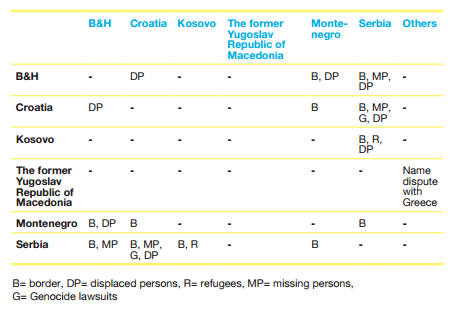

## Relevance and Explanation of the Issue

*"A decade of internecine war in the region had left behind not only a terrible legacy of human losses and material destruction, but also an unprecedented level of traumatization among the population at large, which contributed to a widespread and generalized sense of victimhood on all sides of the conflict.“* -  **Jonathan Sisson**

As of October 27th, 2015, all Western Balkan States have signed a Stabilization and Association Agreement (SAA) with the European Union (EU). The latest state to enter the Stabilization and Association Process (SAP) was {% tooltip Kosovo declared its independence as a state in 2008, supported by UN Security Council Resolution 1244/99 <a href='http://www.nato.int/kosovo/docu/u990610a.htm'>http://www.nato.int/kosovo/docu/u990610a.htm</a> and the International Court of Justice Opinion on the Kosovo declaration of independence (<a href='http://www.internationallawobserver.eu/2010/07/22/the-icjs-advisory-opinion-is-in-favor-of-kosovo/'>http://www.internationallawobserver.eu/2010/07/22/the-icjs-advisory-opinion-is-in-favor-of-kosovo/)</a>. Kosovo's independence is not recognised by 82 UN Member Countries, including 5 EU Member States. %}Kosovo in April 2016. The EU considers the action of closer integration with the Western Balkans as aligned with the vision of

the European Neighbourhood Policy (ENP), which aims to bring close political cooperation and economic integration with non-Member States. The Western Balkans are clear about their ambition to join the EU, yet the aftermath of the Yugoslav wars bears a large print on peace and security in the area.

The wars that took place during the years of dissolution of The Socialist Federal Republic of Yugoslavia (SFRY)   were **ethnic conflicts** in their nature. The International Center for Transitional Justice estimates that the Yugoslav Wars resulted in the deaths of 140,000 people. A number of devastating events occurred during the war times, such as the Siege of Sarajevo, Srebrenica massacre,North Atlantic Treaty Organization (NATO) bombing of Yugoslavia . **War crimes** are violations of the Geneva Conventions  or any other rules of war established by official regulations in the field of International Humanitarian Law (IHL) . Examples of war crimes include murder, mutilation, cruel treatment and torture, taking of hostages, rape, sexual slavery, human trafficking. Currently, the war crimes committed during the Yugoslav Wars are prosecuted by **International Criminal Tribunal for the former Yugoslavia (ICTY)**  in The Hague. Customary International Humanitarian Law (CIL) comes from generally accepted practices by states and exists aside from the treaties of the IHL. International tribunals, such as the ICTY help develop and define CIL.

10 years after the word "Yugoslavia" was erased from world maps, a vast number of local and international stakeholders are currently actively engaged in conflict transformation and reconciliation processes in Western Balkans.

## Key Questions

* How can the local government representatives be more effectively involved in conflict reconciliation?

* How should international bodies react to the conflicting views of citizens of Western Balkans?

* How should the scandal with the Bosnian dorm being namedafter Radovan Karadžić right after he was sentenced by ICTY be addressed?

* What can be done to more actively involve general citizens in the dialogue towards reconciliation?

* Should there be a common and coherent approach to the issue among international and local actors? If so, how can it be obtained?

* How should the topic of Balkan wars be addressed in educational institutions?

## Key Facts & Figures

* The SAP begun in June 1999, and continued at Thessaloniki Summit in 2003.

* The SAP includes the following measures: bilateral SSAs, trade relations, financial assistance and regional cooperation

* As of April 2016, the ICTY has indicted 161 individuals, sentencing 80.

* ICTY sentences consist of for four types of crimes: Genocide, Crimes against Humanity, Violations of the Law or Customs of War and Grave Breaches of the Geneva Conventions.

* The annual budget of  The European Union Rule of Law Mission in Kosovo (EULEX) is around 111 million EUR, making it one of the most well-funded foreign missions of the EU.

* The mandate of EULEX ends on June 14th, 2016. The decision to prolong or close the mission is taken by EU Member States, and has not been finalised yet.

## Key Actors

**The EU** has developed a policy that aims to support development of Western Balkan countries with aim of further integrating them with the EU. The **European Parliament (EP)** is the decision-making body of the EU taking responsibility for the Stabilisation and Association Process.

**The OSCE** has field operations in five Western Balkan countries: Bosnia and Herzegovina, Kosovo, Montenegro, Serbia, and Skopje. The mandates of missions cover a wide variety of fields, ranging from arms control to anti-discrimination.

**NGOs and civic society** are integral to successful conflict transformation processes. NGOs like  Omladinski Odbor za Obrazovanje, with financial support of the British Embassy in Serbia, annually organises the seminar "Youth Reconciliation Ambassadors".  Youth Initiative for Human Rights  is another civic initiative present in 5 former Yugoslav states that facilitates dialogue and exchange between youth in the region. Both international and local NGOs take an active role in initiating dialogue and facilitating reconciliation, yet there is very little coherence between their actions.

## Key Conflicts

**Disputed Bilateral Issues among Countries**

As shown in Table 1, the main remaining areas for dispute between former Yugoslav states are borderlines, missing and displaced persons, refugees and  Genocide lawsuits. Additionally, Former Yugoslav Republic of Macedonia (FYROM) is in ongoing debate with Greece in regards to its name.

 

 

*Table 1. Source: [Vesnic-Alujevic, L. (2012). European Integration of Western Balkans: From Reconciliation To European Future.](http://www.martenscentre.eu/sites/default/files/publication-files/european-integration-western-balkans.pdf)*

**Identity**

In the aftermath of the conflict, a huge amount of Yugoslav people fled from their homes, becoming refugees in other Yugoslav states. Their integration was not so successful, for instance, Serbs who fled to Croatia in beginning of 1990s only managed to obtain Croatian citizenship in the 2000s. Another problematic identity group are Roma people that had citizenship of Yugoslavia, yet after the breakup of the country, they have no prospects of obtaining new passports, leaving them stateless. Moreover, Slovenia was recently condemned by the European Court on Human Rights for erasing more than 25,000 people from their application for citizenship, turning former Slovenian citizens into stateless people overnight.

**Internationalisation of {% tooltip International Centre for Transitional Justice defines the concept as follows: '... (it) refers to the set of judicial and non-judicial measures that have been implemented by different countries in order to redress the legacies of massive human rights abuses. These measures include criminal prosecutions, truth commissions, reparations programs, and various kinds of institutional reforms.' Retrieved from<a href='https://www.ictj.org/about/transitional-justice'>https://www.ictj.org/about/transitional-justice</a> %}Transitional Justice**

The entrance of international actors on the Balkan scene was identified as "the most promising incentive for the enhancement of post-conflict reconciliation in the region" (Rupnik, 2007). With the ICTY taking the lead in prosecuting war criminals, the EU fostering the SAP in the region and starting initiatives like EULEX, most, if not all, transitional justice processes in Western Balkans are handled by foreign stakeholders. However, the ICTY is  widely perceived as unfair, partial and subjective by people in the former Yugoslavia .  Furthermore, EULEX was investigated in a number of corruption trials. International attempts to handle local problems might seem effective from an international perspective, while remaining actively questioned and mistrusted from a local standpoint.

**Reconciliation**

*"(I) conclude that – practically – reconciliation in the region does not exist; it is not even spelled out and accepted as a realistic goal"* -  Dr. Mitja Žagar

A  number of political science scholars identify that topic of reconciliation is absent from media discourse and public education, thus questioning effectiveness of reconciliation processes that are initiated by international players. Political leaders continuously deny war crimes committed by senior politicians, which negatively affects transformational initiatives. Moreover, Perry (2009) identifies a "gap between people and politics", that is the lack of bottom-up movements calling for reconciliation as a key problem for establishing efficient post-conflict dialogues.

## Measures in place

### Transitional Justice

**Criminal Prosecutions**

War crimes prosecution is the most developed transitional justice mechanism in the region. Locally, prosecutions took place in specialized chambers in Bosnia and Herzegovina, Croatia and Serbia. However, the quality of the prosecution’s was set unevenly. The ICTY, established in 1993 by the United Nations Security Council, is currently performing the function of investigating and prosecuting war crimes. Moreover, the Kosovo Relocated Specialist Judicial Institution, often referred to as the **Kosovo Court**, is  expected to be established in The Hague later in 2016. This institution will prosecute crimes committed by participants of the Kosovo Liberation Army (KLA) during 1999-2000, one of the serious allegations that the court ambitions to examine is  organ-trafficking.

**Truth-seeking initiatives**

National initiatives to investigate the root causes of committed war crimes  failed to perform their  functions. In 2005,  Regional Commission on Establishing the Facts in the Former Yugoslavia (RECOM) was established to serve as a facilitator for social debate and to establish facts about the past.

**Reparations**

Reparations to victims of war conflicts may be in form of financial compensation, memorials and restitution of rights. International Organisation for Migration (IOM)’s report on  Reparations for Wartime in Former Yugoslavia estimates, that as of 2012, there is a total of 40,000 persons that went missing during the war times, with 14,000 still being unaccounted for. The report concludes efforts in reparations to be insufficient, further calling for an establishment of a comprehensive approach.

### Dialogue

The Balkan Reconciliation Initiative (BRI) organised by The European Council on Tolerance and Reconciliation together with German Foundations the Bertelsmann Stiftung and the Robert Bosch Stiftung. The BRI served as a **platform for dialogue among political leaders** of the Western Balkans. The conference emphasised the importance of tolerance as the key feature for social stability in a growingly multi-ethnic Europe for peaceful collaboration and development. Moreover, it concluded that political leadership, education and legal solutions all play crucial role in peaceful coexistence of various nations and religions.

**Dialogue among youth** is actively fostered by a number of NGOs and international donors.  A case study  conducted by Kosić and Livi in Croatia focused on factors influencing openness to reconciliation among high school students has identified that positive parental communication is most associated with reconciliation, and significantly more so than with sense of victimhood.

## Links for Further Research

* <a href='http://www.icty.org/en/about/what-former-yugoslavia'>http://www.icty.org/en/about/what-former-yugoslavia</a> What is the former Yugoslavia? The article focuses on shortly explaining the history of formation of Yugoslavia and the different names of the country.

* <a href='http://www.icty.org/en/about/what-former-yugoslavia/conflicts'>http://www.icty.org/en/about/what-former-yugoslavia/conflicts</a> Breakdown of Conflicts in Yugoslavia by country.

* <a href='http://news.bbc.co.uk/2/hi/europe/1420133.stm'>http://news.bbc.co.uk/2/hi/europe/1420133.stm</a> What is a War Crime?

* <a href='http://www.balkaninsight.com/en/balkan-transitional-justice/what-is-transitional-justice'>http://www.balkaninsight.com/en/balkan-transitional-justice/what-is-transitional-justice</a> What is Transitional Justice? The article gives definition to traditional justice, at the same time providing context for transitional justice processes in Yugoslavia.

* <a href='https://www.icrc.org/customary-ihl/eng/docs/home'>https://www.icrc.org/customary-ihl/eng/docs/home</a> Database of International Committee of the Red Cross (ICRC) with Geneva Conventions and useful sources on Humanitarian International Law.

* <a href='https://www.icrc.org/eng/war-and-law/treaties-customary-law/customary-law/overview-customary-law.htm'>https://www.icrc.org/eng/war-and-law/treaties-customary-law/customary-law/overview-customary-law.htm</a> ICRC’s article defining Customary International Law

* <a href='http://www.ecmi.de/fileadmin/downloads/publications/JEMIE/2012/Petricusic.pdf'>http://www.ecmi.de/fileadmin/downloads/publications/JEMIE/2012/Petricusic.pdf</a> Reconciliation in the Western Balkans: New Perspectives and Proposals. A short overview of latest studies of reconciliation processes in the region.

* <a href='http://www.balkaninsight.com/en/article/how-will-special-kosovo-court-work--08-05-2015'>http://www.balkaninsight.com/en/article/how-will-special-kosovo-court-work--08-05-2015</a> An Article explains working procedures of Kosovo’s New War Court

* <a href='http://www.eulex-kosovo.eu/?page=2,13,44'>http://www.eulex-kosovo.eu/?page=2,13,44</a> Video: What does EULEX do in Kosovo?

* <a href='http://www.balkaninsight.com/en/article/some-balkan-citizens-count-for-less-than-zero'>http://www.balkaninsight.com/en/article/some-balkan-citizens-count-for-less-than-zero</a> Citizenship and Identity in the Western Balkans: Some Balkan ‘Citizens’ Count for Less Than Zero. The article deals with the topic of national identity in Western Balkans.
