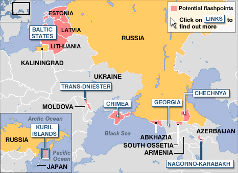
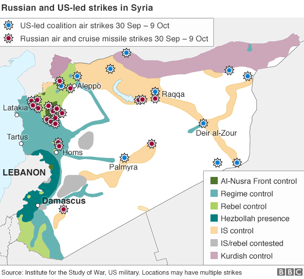

## Relevance and Explanation of the Issue

At the moment there are many conflicts happening all around the world and the Russian Federation plays a part in many of them. Conflicts in post-soviet countries often involve separatist movements aimed at breaking away from one of the successor states and often they end without a peaceful resolution and are referred as frozen conflicts. Rebel groups are essentially left free to control large chunks of the territories they claim and state governments do not exercise full control over areas still under the control of rebels, thus creating chaos in the country. Since 1990 Russia was involved in a number of heated conflicts in Georgia, Azerbaijan, Armenia, Moldova and most recently Ukraine.

These actions by the Russian Federation do not go unnoticed and are condemned by the western world. The annexed territories such as Crimea are not recognized by the majority of UN Member States. Actions committed by Russia were recognised as opposing various international laws and treaties such as the Charter of the United Nations, the Final Act of the Helsinki Conference, the Constitution of Ukraine amongst others. The EU, NATO and OSCE worked and continue to work together to solve these conflicts; joint delegations are sent to negotiate ceasefires, military presence in the region has increased and independent observers are sent. The UN Office of the High Commissioner for Human Rights and the OSCE deployed on-the-ground monitoring missions and teams of human rights monitors throughout the conflict reported numerous violations of human rights and media freedom.

It should be noted that when analysing current conflicts, a centerpiece of modern international law is that a country’s territory changes only by consent, never by force. There is concern that if this rule of territorial stability is compromised, there will be severe repercussions to global stability and statehood.

## Key Questions

* What role should the EU be playing with regards to resolving conflicts related to Russia’s actions abroad?

* How can mutual trust and cooperation be re-established without forgoing and ignoring violations of human rights?

* What actions can be taken in order to prevent the conflicts from escalating?

* What are the key reasons as to why relations between Russia and the West are difficult to normalise?

* What should be the stance of the West with regards to the annexation of Crimea, South Ossetia and Abkhazia?

## Key Facts & Figures

* Vladimir Putin has enjoyed approval ratings of around 85% ever since annexing Crimea. These numbers are largely the consequence of propaganda as the media is a key actor in shaping the public opinion.

* According to an official Independent International fact-finding report about the five-day Georgian conflict, 170 servicemen, 14 policemen, and 228 civilians from Georgia were killed and 1,747 wounded; 67 Russian servicemen were killed, and 283 were wounded, and 365 South Ossetian servicemen and civilians were killed.

* Due to the economic sanctions imposed: Russian ruble's value dropped by 20%, interest rates increased from 10.5% to 17% and inflation reached a high of 16.4% in April 2015.

* The EU is Russia's largest trading partner, making up for around 50% of the exports market, while Russia to the EU is third of importance.

* The significance of mutual cooperation can be seen through natural resources dependence –  30% of oil and about a half of natural gas consumed in the EU comes from Russia.

## Key Actors

### The European Union (EU)

Even though, apart from Baltic States and Poland, Member States are not extremely concerned by Russian foreign policy developments, the EU plays a vital role in this issue. The EU has no direct influence over Russia, however the EU has control over the common market and thus can introduce restrictive measures - sanctions. Together with the United States the EU imposed sanctions that focused on Russia's key defense, energy, and financial service sectors and together with severe drop of oil prices resulted in 2014 - 2015 Financial Crisis in Russia.

### Organization for Security and Co-operation in Europe (OSCE)

The world's largest security-oriented intergovernmental organization that has a comprehensive approach to security that encompasses politico-military and economic aspects. Some of the areas that OSCE focuses are border management, conflict prevention and resolution, economic activities and democratization. Decisions are made by finding a consensus and are not legally binding.

### United Nations Security Council (UNSC)

Under the Charter of United Nations its primary responsibility is for the maintenance of international peace and security. The Security Council consists of 15 Members five of them (China, France, Russia, United Kingdom and United States) are permanent and have the power to veto any resolution. The Council has the power to take military action against an aggressor, call on Members to apply economic sanctions and other measures not involving the use of force to prevent or stop aggression and more.  

### North Atlantic Treaty Organisation (NATO)

A political and military alliance consisting of 28 Member States with the purpose to safeguard the freedom and security of its members through political and military means. The article 5 of Washington Treaty is currently of great importance to the Baltic States - it is a safeguard measure and a promise of assistance should any threat to their sovereignty occur.

### National Governments

Even with all the supranational organisations, the national governments of affected countries are still the main stakeholders in the issue. It is up to Ukraine, Georgia and others to take measures regarding their national security.

## Key Conflicts

The clear existence of international laws’ and human rights’ infringement seen in heated conflicts between Russia and Georgia and Ukraine cannot be left unsettled. Further, an alarming new trend of warfare can be seen – a {% tooltip Hybrid warfare 'is a blend of hard and soft power; a combination of instruments, some military and some non-military, choreographed to surprise, confuse and wear down an opponent, hybrid warfare is ambiguous in both source and intent, making it hard for multinational bodies such as NATO and the EU to craft a response.' Full article: <a href='http://www.economist.com/news/briefing/21643220-russias-aggression-ukraine-part-broader-and-more-dangerous-confrontation'>http://www.economist.com/news/briefing/21643220-russias-aggression-ukraine-part-broader-and-more-dangerous-confrontation</a> %}hybrid warfare.

### Georgia

One of the most noticeable heated conflicts involving Russia, but already forgotten by the western societies, happened not so long ago, in 2008, a so called "First European war of the 21st century" took place, as Russia gained control over some Georgian territories. This Russo-Georgian war resulted in so called independence of South Ossetia and Abkhazia and the establishment of Russian military bases in those territories.** During the conflict international observers were present, however due to Russia’s veto, in 2009 UN observers had to leave Georgia after 16 years as the mission was not extended.

Steven Eke, BBC Russian affairs analyst, in autumn of 2008, after Russo-Georgian war tried to draw everyone’s attention to other possible conflict zones as seen in the map.

 

 
*Source: <a href='http://news.bbc.co.uk/2/hi/in_depth/7596169.stm'>http://news.bbc.co.uk/2/hi/in_depth/7596169.stm</a>*

The analyst also highlighted the method that the Russian Federation uses to create disputes in the areas: granting Russian citizenship, simply by handing out Russian passports, to ethnic minorities in the foreign states.

### Ukraine

Moving on to the events of early 2014 in Ukraine that had the whole world on the edge of their seats when just in a matter of weeks the lives of Ukrainians changed dramatically. The Crimean referendum was one of the key events where allegedly 96.7% vote in favor of leaving Ukraine and being annexed by Russia. The conflict already has resulted in annexation of Crimea, th eemergence of the self-declared Donetsk People's Republic (DPR) and Luhansk People's Republic (LPR), {% tooltip Further information in the report on the human rights situation in Ukraine: <a href='http://reliefweb.int/sites/reliefweb.int/files/resources/10th%20HRMMU%20report%20-%20Ukraine%20-%201%20June%202015.pdf'>http://reliefweb.int/sites/reliefweb.int/files/resources/10th%20HRMMU%20report%20-%20Ukraine%20-%201%20June%202015.pdf</a> %}6362 killed and 15775 wounded Ukrainians and pervalent chaos. The Western response to this war was condemning the actions of and placing economic and political sanctions on Russia. Economic sanctions indeed had significant economic consequences to Russian economy. In March 2016, two years after the annexation, a statement delivered by the Delegation of Ukraine to the meeting of the Permanent Council of OSCE stating that there are no signs of Russia abandoning its aggressive politics in Ukraine further urged the restoration of respect for the norms of international law and the reversal of the illegal occupation of Crimea.

### Turkey

Some analysts say that in 2016 Russia’s foreign policy is going to be adversely affected by Russian-Turkish tensions given that the Kremlin imposed immediate economic sanctions and visa free travel restrictions against Turkey as a result of Turkey shooting down a Russian aircraft close to the Turkish-Syrian border. Further, since Turkey is a member of NATO, the event was viewed cautiously by the world as it was the first time in half a century that a NATO country had shot down a Russian airplane.

### Syria

Russia joined the Syrian civil war in autumn of 2015 as a result of an official request by the Syrian government. In this conflict Russia states that their objective is to help the Syrian government retake control of lost territories from various opposition groups, including ISIL, however as seen in a map bellow - very few airstrikes were against ISIL.

 

 
*Source: <a href='http://www.bbc.com/news/world-middle-east-34502286'>http://www.bbc.com/news/world-middle-east-34502286</a>*

Further, the Russian military has been accused by various NGOs of war crimes, for instance the deliberate targeting of hospitals and civilians and the use of banned cluster munitions.

### Baltics

The increasing tensions in the region are without a doubt felt by most. Reports of unprecedented numbers of Russian naval or air force around the Baltic region show up almost every week in the news. Seemingly limitless resources are deployed in Lithuania, Latvia and Estonia to manipulate the media in an attempt to change people’s opinion regarding national affairs, Russia and the West. In recent years Latvia and Lithuania even imposed temporary bans on the Russian-owned TV channels for breaking local laws by inciting hatred and knowingly disseminating false information.

## Measures in place

The Minsk II agreement  was signed after a first unsuccessful attempt.

The Minsk Protocol also aimed to stop the conflict in Ukraine. The agreement was signed by the representatives of Ukraine, Russian Federation, France and Germany and was supervised by OSCE. Although the agreements of summit did to some extent decrease military actions in Donbass region, it did not resolve the conflict completely.

Lastly, as aforementioned, there are economic and political sanctions in place by the US and the EU against Russia that indeed have affected Russian economy, although the true effect of sanctions on Russian foreign policy is debatable.

## Links for Further Research

* Russia, Ukraine and International Law - <a href='http://www.robert-schuman.eu/en/doc/questions-d-europe/qe-344-en.pdf'>http://www.robert-schuman.eu/en/doc/questions-d-europe/qe-344-en.pdf</a>

* The Economist: From cold war to hot war - <a href='http://www.economist.com/news/briefing/21643220-russias-aggression-ukraine-part-broader-and-more-dangerous-confrontation'>http://www.economist.com/news/briefing/21643220-russias-aggression-ukraine-part-broader-and-more-dangerous-confrontation</a>

* European Parliament Breifing: Sanctions over Ukraine - <a href='http://www.europarl.europa.eu/RegData/etudes/BRIE/2016/579084/EPRS_BRI(2016)579084_EN.pdf'>http://www.europarl.europa.eu/RegData/etudes/BRIE/2016/579084/EPRS_BRI(2016)579084_EN.pdf</a>

* Russian hybrid warfare and other dark arts -[ http://warontherocks.com/2016/03/russian-hybrid-warfare-and-other-dark-arts/](http://warontherocks.com/2016/03/russian-hybrid-warfare-and-other-dark-arts/)

* Russian propaganda creates 'parallel reality' for Lithuania's ethnic minorities - <a href='http://www.lrt.lt/en/news_in_english/29/122506/russian_propaganda_creates_parallel_reality_for_lithuania_s_ethnic_minorities'>http://www.lrt.lt/en/news_in_english/29/122506/russian_propaganda_creates_parallel_reality_for_lithuania_s_ethnic_minorities</a>				

* John Mearsheimer: Why the Ukraine Crisis is the West’s Fault - <a href='http://webcache.googleusercontent.com/search?q=cache:K7Bal_3spEYJ:mearsheimer.uchicago.edu/pdfs/Ukraine%2520Article%2520in%2520Foreign%2520Affairs.pdf+&cd=1&hl=en&ct=clnk&gl=us'>http://webcache.googleusercontent.com/search?q=cache:K7Bal_3spEYJ:mearsheimer.uchicago.edu/pdfs/Ukraine%2520Article%2520in%2520Foreign%2520Affairs.pdf+&cd=1&hl=en&ct=clnk&gl=us</a> 	

* Sphere of Influence: Russia's Foreign Policy - <a href='https://www.youtube.com/watch?v=sPoimjn_CfQ'>https://www.youtube.com/watch?v=sPoimjn_CfQ</a> 	
