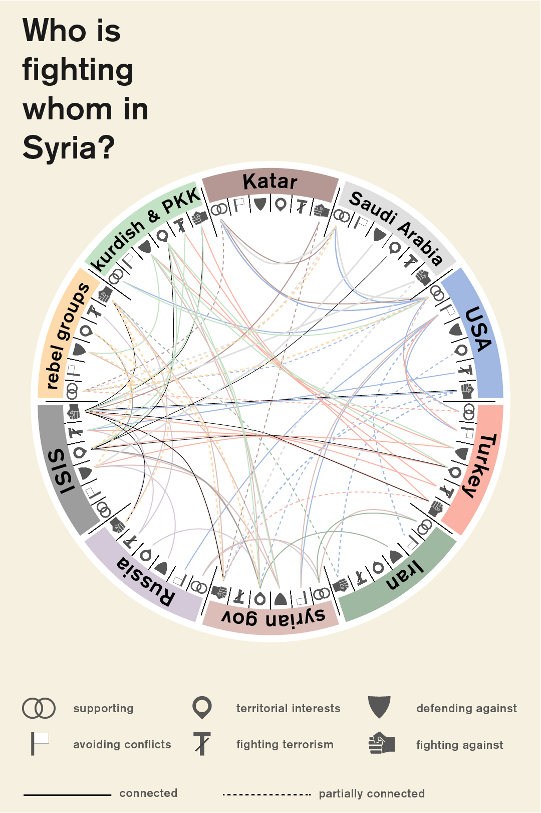

## Relevance and Explanation of the Issue

The so-called Islamic State (aka ISIS, ISIL, Daesh, IS) has become one of the foremost threats to European and OSCE States in the current geo-political sphere. ISIS holds  a swathe of territory across the Iraqi-Syrian border and has inspired terrorist attacks in a number of States including France, Turkey, Yemen and Belgium. It has amassed an army that comprises of around  30,000 foreign fighters from over 80 countries  and armed itself with a mixture of high tech US weapons plundered from Iraqi bases and small arms smuggled from a number of illicit sources, even  from within the Syrian Army itself .

Yet the clarity with which the ISIS threat is perceived is counteracted by discord and confusion in how to deal with, or even define, the group. ISIS is both a religious creation, a group mutated from Al-Qaida in Iraq following ideological differences and a political entity. An entity created to exploit weak security in the region and supported by those who oppose the Iraqi Shi’ite government, namely Sunni tribes and opportunistic members of  Saddam Hussein’s exiled Ba’ath Party . It could be seen as a fledgling State, with taxation, supply chains and law enforcement. It is also the embodiment of an extremist ideology that inspires its followers.

Combatting ISIS requires a holistic approach that tackles all of these identities, yet each avenue brings a unique challenge. The will for military intervention by OSCE participating States is soured by the Afghanistan and Iraq experience. Economic pressure, largely exerted through tactical air strikes, damages the local economy and population. Radicalisation and the prospect of returning fighters continues to be an issue that is dealt with on a  national, not international basis, possibly a result of States not wanting to air dirty laundry in public.

Consistency and coherency is in short supply in international responses to the ISIS threat. Who should supply that coherency, and what this international strategy should be, is still very much up for debate.

## Key Questions

* To what extent is the establishment of ISIS either a reaction to the political situation in Iraq and Syria or a result of a wider ideological battle against the ‘West’?

* Understand the enemy - What are the aims and motivations of the ISIS command?

* What explains the high number of citizens from OSCE participating States leaving to fight for ISIS? How can this be stemmed?

* What role should religion, and religious groups, have in the tackling of ISIS?

* How can Iraqi and Syrian civilians be protected in the war against ISIS? What effect would measures against the Caliphate have on the wider population?

* Which international organisations are best placed to lead the fight against ISIS?

* The world post-ISIS. What measures and plans should be put in place to prevent the group, or a mutation of it, growing again in the region?

## Key Facts & Figures

**ISIS Territory**

Since the start of 2015, ISIS has lost  around 22% of its territory in Syria and Iraq . This includes a number of key sites, namely the symbolic city of Palmyra, taken by the Syrian Army and the key border town Kobane,  despite recent attempts to recapture it . Despite this, ISIS still controls a number of oilfields in Syria and Iraq as well as crucial main cities like Mosul and Raqqa. Added to this, ISIS continues to grow in Libya and the number of fighters there has doubled as the group takes advantage of the post-Gaddafi chaos in the country.

<iframe src="http://umap.openstreetmap.fr/en/map/desyracuse-syria-civil-war-1-april-2016_78954#6/34.556/38.101" width="100%" height="450px"></iframe>

**ISIS Economy**

Initially, ISIS were reportedly making $1.5 million a day through oil production though  airstrikes have seen this production drop by an estimated 30% . Struggling finances has affected ISIS wages and therefore morale, but the group still controls around 60% of Syrian oil fields.

**ISIS International Terror**

ISIS has become an increasingly international operation. It has mobilised international brigades within its army with a view of turning them against their homeland and  claimed responsibility for a number of acts of terrorism  and inspiring attackers in a number of locations such as San Bernardino, California.

## Key Actors

An introduction into the competing actors in Syria:
 

 
*Source: [E Medien Blog (2015) Who is fighting whom in Syria?](http://emedien.design.hs-anhalt.de/projektblog/?p=3341)*

**EEAS**

The European External Action Service  acts as the diplomatic service for EU Member States, supporting the High Representative for Foreign Affairs, Federica Mogherini  and ensuring the defence of EU interests around the world. Mogherini has already stated her belief that Syrian diplomacy is the only path to defeating ISIS and has  supported thawing relations with Iran.

**OSCE**

The Organisation for Security and Co-operation in Europe actually comprises of 57 States including Russia and the United States. As a forum for political discussion and coordination it is well placed to help facilitate a coherent international response to the threat of ISIS, as well as supporting expertise and training in a range of areas such as border control and counterterrorism.

## Key Conflicts

The options for physical action against between ISIS is understood best when contextualised with the following ideological conflicts and realities on the ground:

**The appetite for international military intervention vs its necessity**

One of the critical impasses in international responses to ISIS is balancing the need for military action with the lessons of failed intervention in the Middle East. Current airstrikes have checked ISIS, but it will not destroy the group. The history of bombing campaigns not only show that civilian casualties are virtually inevitable, but that even unprecedented scale cannot guarantee results - the  US Cambodian campaign in the late 60’s is testament to this.

Yet protracted land campaigns in Iraq and Afghanistan cost the lives of thousands of soldiers and still didn’t deliver lasting security. Poor post-war planning and sectarian violence in Iraq fuelled the rise of ISIS itself, and the  Taliban have gained much of the ground fought for in Afghanistan. More recently, Barack Obama has admitted that the  failure to plan for a post-Gaddafi Libya was the biggest mistake of his presidency. With ISIS growing in the power vacuum of Libya, there is a stark reminder of the complexity, and difficulty, of military intervention.

**Balancing International interests**

The second key conflict to remember is the inherent need to coordinate an international response to the ISIS threat that reflects the number of competing national and international interests in the region.

Iran’s interests in the Middle East have always been at odds with those of Saudi Arabia. Both take on the mantle as protector for their own branch of Islam, whether it be Iran’s defence of Shi’a muslims or Saudi Arabia’s proliferation of Wahabi strands of SUnni Islam. Iran has subsequently  supported Iraq’s enfeebled Shia government in the fight against ISIS. Saudi Arabia by contrast has been criticised for allegedly  supplying weapons to the Sunni tribes that fight with ISIS. With ISIS suicide attacks in Iraq aimed at dividing religious groups further, efforts must be made to prevent further sectarian tension and the restoration of security that does not provoke Iranian or Saudi Arabian ambition.

Russia’s intervention in the Syrian Civil War is also a warning of conflicting aims amongst OSCE participating States. All OSCE States are committed to the destruction of ISIS, but Russia’s ambition to maintain it’s warm water port in Syria also links back to its occupation of Crimea. Putin’s support of the Assad regime also exacerbates discord amongst EU Member States on the  role of Assad in a post-civil war Syria. The world beyond the civil war and ISIS is also a source of international tension for Turkey. Ankara is vehemently opposed to the Kurdish independence movement, and labels many Kurd groups as terrorists. They have  stepped up bombing against the Syrian Kurds, attacking the very group that are also fighting ISIS. With a number of EU Member States  arming the Kurdish fighters, the issue of an independent Kurdistan is one that cannot be ignored.

## Measures in place

**Current military measures:**
 

 
*Source: [US Department for Defence (2016) Operation Inherent Resolve](http://www.defense.gov/News/Special-Reports/0814_Inherent-Resolve)*

The US-led Combined Joint Task Force, titled Operation Inherent Resolve, has to date conducted over 11,500 airstrikes against ISIS at a cost of $6.5 billion. A number of EU Member States, as well as OSCE Participating States, have contributed, including the UK, Belgium, Denmark, France and the Netherlands. Following Russia’s partial withdrawal from Syria, it’s military has been working closer with the US coalition to  target the ISIS stronghold in Raqqa.

Beyond Operation Inherent Resolve, Iraqi Army deployments are also being supported by Iranian militias and American fire bases and the long battle for Mosul, the ISIS stronghold in Iraq, is set to begin - though many feel that  ISIS will hold the city until 2017.

## Links for Further Research

* An Introduction to ISIS: [http://theweek.com/articles/589924/brief-history-isis](http://theweek.com/articles/589924/brief-history-isis)

* ISIS oil economy explained: [http://ig.ft.com/sites/2015/isis-oil/](http://ig.ft.com/sites/2015/isis-oil/)

* Understanding the OSCE: [http://www.osce.org/whatistheosce/factsheet?download=true](http://www.osce.org/whatistheosce/factsheet?download=true)

* Twitter account - Updates on Syrian and Iraqi territorial changes: [https://twitter.com/deSyracuse/status/716143815799779329](https://twitter.com/deSyracuse/status/716143815799779329)

* Twitter account - Updates on Operation Inherent Resolve and airstrikes: [https://twitter.com/CJTFOIR](https://twitter.com/CJTFOIR)
