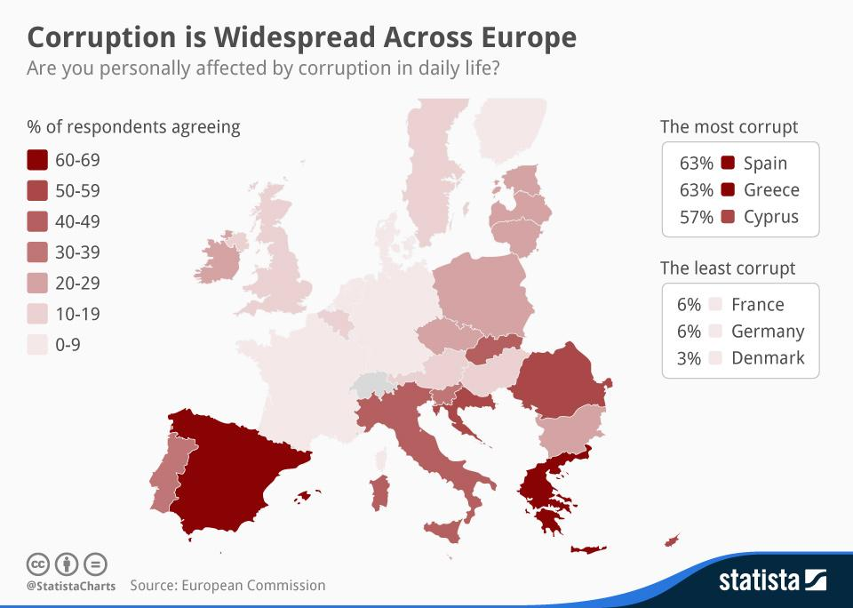
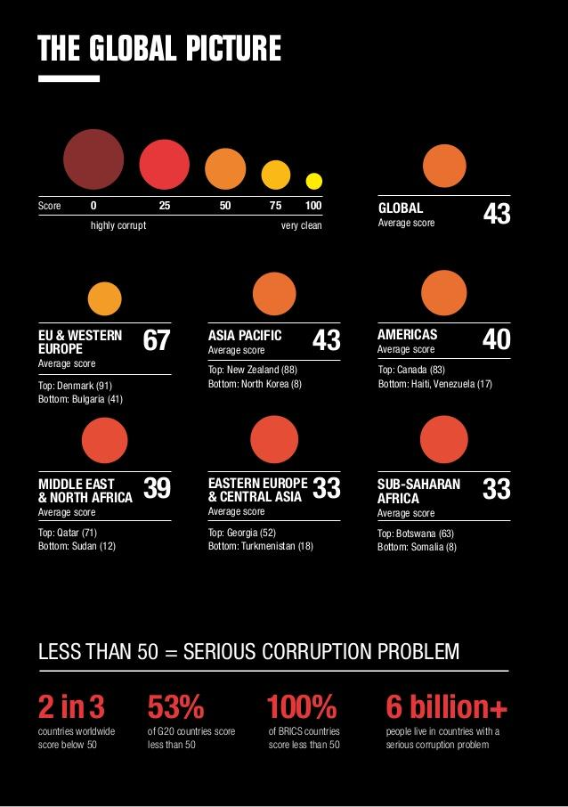

## Relevance and Explanation of the Issue

The notion of good governance was adopted by the World Bank in the late 1990’s to establish the link between the quality of a country’s governance system and its ability to promote sustainable economic and social development. Good governance is exactly the way that a government should function. According to the **World Bank**, the core elements of a good governance are: **public sector management**, **accountability**, **a legal framework for development** and **transparency and information**. Indeed, transparency and openness are key elements of good governance and set barriers to corruption. In his essay *Perpetual Peace*, Immanuel Kant noted that publicity was a moral requirement for public authorities and stated: "all actions relating to the rights of other men are wrong, if the maxims from which they follow are inconsistent with publicity". He also maintained that as well as being a moral principle, it was also a legal one perceiving transparency as a legal rule.

Consequently, seeing this matter not only from the economic field but rather with a systematic approach, a government should be fair, treat all the citizens equally and respect democratic procedures. In other words, it is the way how a government should organise itself and its public policies. Moreover, this goes hand in hand with the fight against corruption, a great malfunction in the social, political and economic life of a state.

The nature and extent of corruption vary. **Corruption**, nevertheless, inflicts financial damage by lowering investment levels, hampering the fair operation of the internal market and reducing public finances. It causes social harm as organised crime groups use corruption to commit other serious crimes, such as trafficking drugs and human beings. Moreover, if not addressed, corruption can undermine trust in democratic institutions and weaken the accountability of political leadership.

## Key Questions

* Which principles should be followed to fight corruption?

* How can the EU harmonise the implementation of anti-corruption measures within all the Member States?

* What kind of achievements are needed so that corruption could be tackled at regional, national and international level?

* How can transparency and openness be ensured in the public sector?

* How good governance can be strengthened and development be fostered at National and European level?

* What measure should be taken to prevent corruption? What kind of sanctions should be imposed?

## Key Facts & Figures

The World Bank has identified corruption as **the single greatest obstacle to economic and social development**. It undermines development by distorting the rule of law and weakening the institutional foundation on which economic growth depends. It is estimated that financial losses of **120 billion Euros** per year, or one percent of the EU GDP, is lost to corruption.

Public opinion plays an important role in identifying how much of an everyday and common problem corruption is and how it affects most parts of society. With the 2014 Special **[Eurobarometer on Corruption](http://ec.europa.eu/public_opinion/archives/ebs/ebs_397_en.pdf)**, there has been some interesting findinsg that highlight the current situation in the EU as well as the differences, not only the legal ones but also the societies’ opinions and beliefs:

* **In the EU, three quarters of respondents (76 %) think that corruption is widespread in their own country.** This belief is widespread especially in countries such as Greece, Italy Lithuania, Spain and the Czech Republic .

* **Around three quarters of Europeans (73 %) say that bribery and the use of connections is often the easiest way of obtaining certain public services in their country.**

* **Two in three Europeans (67 %) think the financing of political parties is not sufficiently transparent and supervised.** Most likely to hold that view are respondents from Spain, Greece  and the Czech Republic

* **Just under a quarter of Europeans (23 %) agree that their Government’s efforts are effective in tackling corruption.**

* **Four out of five EU citizens regard corruption as a serious problem in their Member State.**

 

 
*Source: [The Statistics Portal - Statista](https://www.statista.com/chart/1853/corruption-is-widespread-across-europe/)*

## Key Actors

[European Commission (EC)  & Member States](http://eur-lex.europa.eu/legal-content/EN/TXT/?uri=URISERV%3Alf0004): The European Commission, already having taken on initiatives regarding the [anti-corruption fight], already has a large legal presence in this area with the Communication by the EC on Corruption identifying the necessity for effective prevention, prosecution and judicial cooperation among actors. As the EU Home Affairs Commissioner Cecilia Malmström mentions in this [video](http://www.bbc.com/news/world-europe-26014387), the **Price of not acting is too high**. Nevertheless, what needs to be further examined is the equal and effective participation of all Member States in this effort, by harmonising their efforts, implementing the european framework and co-operating and synchronising their law-enforcement agencies.

The **Organisation for Security and Co-Operation in Europe (OSCE)** has taken great steps in fighting corruption and implementing [good governance]. Steps that the OSCE has been taking on [good governance](http://www.osce.org/what/good-governance) is implementing missions in countries where control is necessary, thus fostering good governance on national and regional levels as well. Taking Kosovo, as an example of country where the OSCE has been active, [the  Anti-Corruption Action Plan in Kosovo](http://www.osce.org/kosovo/21944) has been published as a specific analysis of the situation of this country where the inluence of the corruption affects the society’s opinion on a very high level, therefore, the report proposed steps that could be realised against corruption. This targeted research and later on, its documentation facilitates the exchange of practices and initiates a case-oriented approach.

With the 2012 [OSCE Declaration on Strengthening Good Governance and Combating Corruption, Money-Laundering and the Financing of Terrorism](http://www.osce.org/cio/97968), the OSCE presents a clear image and analysis of the work it has done so far but also highlights the current dangers and promotes cooperation among countries and international organisations as well as  greater involvement of the public and private sector as future actors  in the fight against corruption.

[The United Nations Convention against Corruption](https://www.unodc.org/documents/brussels/UN_Convention_Against_Corruption.pdf) entered into force on 14 December 2005 and until now has been ratified by 175 **United Nations (UN)** Member States (17 UN Member States have not ratified the Convention). This is the most official legal framework on international level which sets the basis for the fight against corruption. More specifically, the main area that it focuses one are: **1) Prevention, 2) Criminalisation of specific practices and 3) International Cooperation.**

[The Council of Europe (CoE)](http://www.coe.int/en/web/about-us/values), within its fundamental goals is the protection of human rights. Regarding this topic, CoE has implemented the **Civil Law Convention on Corruption** and established the **Group of States against Corruption (GRECO)**, which is responsible to monitor commitments entered into under the Convention by the States Party, which are going to be analysed further in the Measures in place section

[Transparency International](https://www.transparency.org/), is a Non- Governmental Organisation, established in 1993, which today is present in more than 100 countries. The organization defines corruption as abuse of entrusted power for private gain which eventually hurts everyone who depends on the integrity of people in a position of authority. Today, this organisation works closely with civil society organizations, companies and governments in the fight against corruption.

[Integrity Pacts](https://www.transparency.org/whatwedo/tools/integrity_pacts/3/) are tools proposed by **Transparency International** for preventing corruption in a sector which is specifically prone to corruption practices, public contracting. They constitute an agreement between the government agency offering a contract and the companies which are interested in taking part in that contract that they will abstain from bribery, fraud and other corrupt practices for the extent of the contract.

## Key Conflicts

### Differences on national level

The implementation of the anti-corruption legal framework remains uneven among EU Member States. This situation creates two issues as not all States have transposed European legislation into their national laws and they have not taken the necessary measures to practically implement these policies and action plans.

### Complexity in dealing with this phenomenon

Exactly because it is widespread and can be seen in various sectors of economy, public or private life, corruption takes many different forms: bribery, judicial, political corruption, fraud, in the labour market, in the educational system. As a result there can be no one-sided approach to deal with this issue, but strengthened control on national levels.

According to [Transparency International’s](http://www.transparency.org/gcb2013) 2013 Global Corruption Barometer, the **public sector** is especially prone to corruption and fraud. **The police and the judiciary** came out as the two most prone to bribery, with 31%  of people who came into contact with the police and 24% of people interacting with the judiciary reporting having paid a bribe. Also, almost two out of three people believe that personal contacts and relationships are the most influential in the public sector in their country, while there is a lack of trust towards the financing of political parties.

Consequently, and driven from the fact that nearly 9 out of 10 people asked by Transparency International supported that they, individually, would act against corruption, what is required is a collective approach from all international, european, national and also local and regional bodies to act together and, indeed, synchronise their efforts. This leads to the dilemma of who should be made responsible to act and how would all these actors combine their actions?

## Measures in place

Due to the importance of fighting corruption while promoting good governance, a variety of measures are in place from a variety of actors at regional, national and international level.

[European Commission's European Anti-Fraud Office (OLAF)](http://ec.europa.eu/anti-fraud/home_en):

OLAF the EU agency which  focuses on the prevention of fraud and corruption, while actively runs criminal investigations of fraud or other serious irregularities with a potentially negative impact for EU public funds and serious misconduct by Members or staff of EU Institutions and bodies. In figures, OLAF has recovered over €1.1 billion of EU money and contributed to the recovery of €100 million a year, on average.

[The Group of States against Corruption (GRECO) by Coe](http://www.coe.int/t/dghl/monitoring/greco/default_en.asp):

GRECO was established in 1999 by the Council of Europe to monitor States’ compliance with the organisation’s anti-corruption standards.  It comprises of 49 member States including the United States of America. GRECO’s objective is to improve the capacity of its members to fight corruption by monitoring their compliance with Council of Europe anti-corruption standards and provides a platform for the sharing of best practice in the prevention and detection of corruption. GRECO does also have a very important monitoring function regarding the treaties’ and international framework’s respect.

More specifically, GRECO carries out an **evaluation procedure** for its members where practical  recommendations are given regarding the legislative and practical reforms needed and a **compliance procedure** so that recommendations can be implemented designed to assess the measures taken by its members to implement the recommendations.

[The Council of Europe’s Civil Law Convention on Corruption entered into force at 1.11.2003](https://rm.coe.int/CoERMPublicCommonSearchServices/DisplayDCTMContent?documentId=090000168007f3f6) and is the first attempt to define common international rules in the field of civil law and corruption. The Convention is divided into **three chapters**: measures to be taken at the national level, international co-operation and monitoring of implementation. Among other priorities, this Convention alsο promotes the compensation and the empowerment of victims, state liability, protection of employees who report corruption and clarity of accounts and audits. [The Civil Law Convention on corruption has not not been ratified by all Council of Europe’s Member States](http://www.coe.int/en/web/conventions/full-list/-/conventions/treaty/174/signatures?p_auth=ZGVkW7MO)

[Treaty on the Functioning of the EU, Articles 67.3, 83.1, 325](http://www.eudemocrats.org/fileadmin/user_upload/Documents/D-Reader_friendly_latest%20version.pdf)

The Treaty on the Functioning  of the EU in article 325, **Combating Fraud** sets a path against illegal activities and in Articles **67.3** and **83.1** stresses the need of State cooperation regarding the elimination of criminal activities, urges Member States to adopt national legislation and impose sanctions to criminal activities. Nevertheless the treaty does not explicitly refer to the combat of corruption, but rather as a part of all illegal activities it incorporates.

[Anti-Corruption Report by the European Commission](http://ec.europa.eu/dgs/home-affairs/what-we-do/policies/organized-crime-and-human-trafficking/corruption/anti-corruption-report/index_en.htm):

The EU Anti-Corruption Report is a new mechanism, implemented in 2013 and published every two years by the EC in order to monitor and assess Member States' efforts against corruption, and consequently encourage them to step up their work and comply with the **European standards**. The 2014 Anti-Corruption Report which has been issued,  presents the **different levels** of anti-corruption engagement of Member States and, for a better exchange of practices and underlines individual measures that have been implemented in certain countries, evaluating their effectiveness.

## Links for Further Research

* Muhammadu Buhari. Nigeria committed to good governance and fighting terror (2015). The Washington Post [https://www.euractiv.com/section/eu-priorities-2020/linksdossier/good-governance-and-corruption/#ea-accordion-further-reading](https://www.euractiv.com/section/eu-priorities-2020/linksdossier/good-governance-and-corruption/#ea-accordion-further-reading)

* EurActiv. Good Governance and Corruption. Legal Background [https://www.washingtonpost.com/opinions/nigeria-committed-to-good-governance-and-fighting-terror/2015/07/20/8c1acd00-2e21-11e5-8353-1215475949f4_story.html](https://www.washingtonpost.com/opinions/nigeria-committed-to-good-governance-and-fighting-terror/2015/07/20/8c1acd00-2e21-11e5-8353-1215475949f4_story.html)

* Transparency International. Corruption per Country/Territory:[ https://www.transparency.org/country/](https://www.transparency.org/country/)

* Transparency International. Anti-Corruption Glossary:[ https://www.transparency.org/glossary/](https://www.transparency.org/glossary/)

* Transparency International: [https://www.transparency.org/whatwedo/activity/strengthening_enforcement_of_the_oecd_anti_bribery_convention](https://www.transparency.org/whatwedo/activity/strengthening_enforcement_of_the_oecd_anti_bribery_convention) and [https://www.transparency.org/whatwedo/activity/european_neighbourhood_south_region_nis](https://www.transparency.org/whatwedo/activity/european_neighbourhood_south_region_nis)

* Transparency International. Fighting corruption, demanding justice: Impact Report (2015):[ http://files.transparency.org/content/download/1926/12715/file/2015_ImpactReport_EN.pdf](http://files.transparency.org/content/download/1926/12715/file/2015_ImpactReport_EN.pdf)

* Documents, publications and tools. United Nations Office on Drugs and Crime: [https://www.unodc.org/unodc/en/corruption/publications.html](https://www.unodc.org/unodc/en/corruption/publications.html)

* World Bank. Corruption and Economic Development.: [http://bit.ly/1tvVSbv](http://web.worldbank.org/WBSITE/EXTERNAL/COUNTRIES/MENAEXT/EXTMNAREGTOPGOVERNANCE/0,,contentMDK:20513159~pagePK:34004173~piPK:34003707~theSitePK:497024,00.html)

* World Bank. Good Governance & Development, the example of Kuwait: [http://blogs.worldbank.org/arabvoices/kuwait-transparency-corruption-political-instability-obstacles-development](http://blogs.worldbank.org/arabvoices/kuwait-transparency-corruption-political-instability-obstacles-development)

* Madaleine Weber. Q&A on Good Governance and Development. 2015. World Resources Institute: [http://www.wri.org/blog/2015/02/qa-mark-robinson-role-good-governance-sustainable-development](http://www.wri.org/blog/2015/02/qa-mark-robinson-role-good-governance-sustainable-development)

 

 
