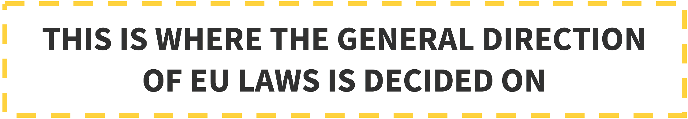
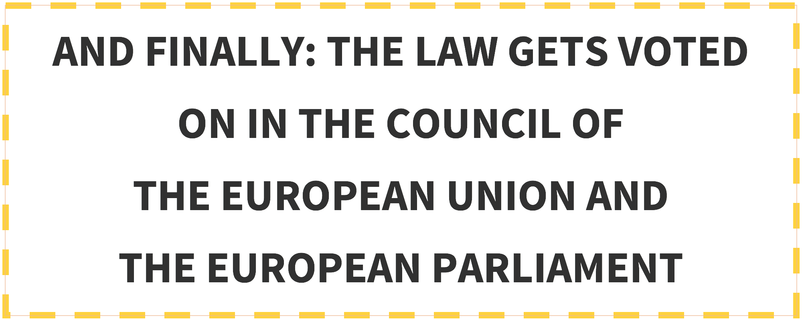

# The European Union’s Institutions – an Overview
*by Kathi Radler, Member of EYP Austria’s Academic Quality Team 2015/16*

Did you ever wonder how EU legislation is made? The European problems we agree on in just a couple of days are a matter of quite difficult processes in reality. You probably already got in touch with the institutions, the procedures and the competences of the European Union, but as it is a quite complicated system, the next section aims at refreshing your memory about its institutions and their most important activities.

## The European Council
{:style="float: right; margin-left: 7px;margin-top: 7px; max-width: 300px;"}Let’s start with the European Council: It consists of the **heads of state or government** and the President of the European Commission. The president of the European Council is elected for 2.5 years and is currently **Donald Tusk** from Poland, who must report to the European Parliament after each meeting. **4 times a year they** all meet in **Brussels**, in order to discuss the **general goals** of the next year. It therefore does not really propose legislations - for example, in their last meeting this march they decided on general directions for an Energy Union in the EU and external relations with Russia and Ukraine, among other topics.

## The European Commission
{:style="float: right; margin-left: 7px;margin-top: 7px; max-width: 300px;"}The European Commission is the **only institution empowered to initiate legislation**. Nevertheless, also the European Parliament, as well as member states and citizens (> 100.000 citizens from at least seven different EU countries) can ask the European Commission to submit a proposal.

Consisting of **28 Commissioners of every member country**, the European Commission furthermore manages the EU-budget and allocates the funding, **enforces EU law** together with the Court of Justice and **represents the EU internationally**. But the European Commission also has its limitations – they are not allowed to command troops, raise taxes or decide on foreign policies, as this is under the power of national legislation.
The commissioners are supported by their **“Directorate Generals”**, which are divided into different areas, such as administration, law, economists or translators. Current president of the European Commission is **Jean Claude Juncker**.

 

 

## Council of the European Union
{:style="float: right; margin-left: 7px;margin-top: 7px; max-width: 300px;"}But we already had… No, wait – the European Council and the Council of the European Union are two different institutions. To make it even more puzzling: it is also not the Council of Europe – this is not an EU institution at all…

Let’s stop the confusion and get started: The Council of the European Union consists of the **ministers of every Member State**, therefore it is also referred to as the **“Council of Ministers”**. It is not presided by a person, but by a state that rotates every six months. Currently this is Latvia.

They have quite a lot to do - under their main tasks you find: **passing the EU laws** jointly with the European Parliament, approving the EU budget, **coordinating the broad economic policies** of the EU member countries, **signing agreements between the EU and other countries, developing the EU’s foreign and defence policies** and the **coordination of cooperation between courts and police forces** of member countries.

 

 

## The European Parliament
Sounds familiar? The namesake of our European Youth Parliament consists of **751 members, directly elected by the EU’s citizens every 5 years**. They gather into different **fractions according to their political stance**. Since the last election in 2014, the **European People’s Party** (Centre-Right) hast the most seats, followed by the **Progressive Alliance of Socialists and Democrats** (Centre-Left). President of the European Parliament is **Martin Schulz** from Germany.

The European Parliament works closely together with the European Commission, as they both have a say on the **EU budget** and jointly have to **decide on EU laws**. Furthermore, they **scrutinise other EU institutions**, in order to ensure that they are working democratically.

### Links to more information on how the EU works

* How it works - European laws: [https://www.youtube.com/watch?v=vnHer1szjrg](https://www.youtube.com/watch?v=vnHer1szjrg)
* EU Institutions explained in 5 Minutes: [https://www.youtube.com/watch?v=APqIcseL_B8](https://www.youtube.com/watch?v=APqIcseL_B8)
* How the European Union works: [https://www.youtube.com/watch?v=O37yJBFRrfg](https://www.youtube.com/watch?v=O37yJBFRrfg)
* The official page of the European Union: [http://europa.eu/index_en.htm](http://europa.eu/index_en.htm)
