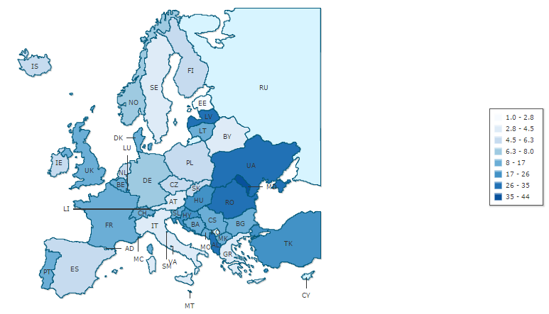

## Relevance and Explanation of the Issue

*"To be realised, reproductive freedom must include not only woman’s right to choose childbirth, abortion, sterilisation or birth control, but also her right to make those choices freely, without pressure from individual men, doctors, governmental or religious authorities. It is a key issue for women, since without it the other freedoms we appear to have, such as the right to education, jobs and equal pay, may prove illusory."* - **The Encyclopedia of Feminism (1986), Lisa Tuttle**

There is no universally agreed upon definition of the Sexual and Reproductive Health and Rights (SRHR) but the most widely recognised one is as follows: "the right of men and women to be informed and to have access to safe, effective, affordable and acceptable methods of family planning of their choice, as well as other methods of their choice for regulation of fertility which are not against the law, and the right of access to appropriate health-care services that will enable women to go safely through pregnancy and childbirth and provide couples with the best chance of having a healthy infant."

While always having been highlighted by feminists as an important determinant of a woman’s life and freedom in general, reproductive rights only became legally recognised as a separate subset of fundamental rights in the 1968 Proclamation of Teheran. As a result, there has since been a clear progress in the last few decades evidenced by the significant drop in global maternal mortality ratio with Europe becoming the frontrunner in fight for reproductive freedom. In addition, the attention in the last decade has slowly shifted from solely dealing with the issues of maternal mortality, transmission of Sexually Transmitted Infections(STIs) and unsafe abortions to promoting  comprehensive sexuality education, family planning and contraceptive use in adolescents.

However, the above-mentioned shift also serves to highlight the already obvious disparity across the continent in the range of problems different regions face. The difference in maternal mortality rates not only demonstrates how Eastern European states are failing to keep up with their western neighbours  but also point to the socio-economic aspect of the issue as the majority of victims come from low income families. Thus, despite being recognised as a basic human right by international community, SRHR are still to some extent treated as a privilege denied to socially and economically vulnerable groups.

The said gap between countries should partially be attributed to the international community’s inability to provide a unified response to the issue. However, with the World Health Organisation’s European action plan regarding the SRHR for 2017-2021 time period being currently in discussion, a new opportunity is provided for stakeholders to help national governments harmonise their policies and improve the level of reproductive freedom in every region.

## Key Questions

* Given the continual cuts of national expenses, how should the poorer countries make basic health services more affordable?

* Should the right to legal abortion be recognised as a basic human right by national governments?

* If yes, should the recognition of legal abortion as a basic human right also guarantee that the procedure is financed by the public health insurances?

* What should the EU’s approach be towards Member States where the abortion is currently strictly limited?

* Considering the lack of competence in the field of education, how can the EU help harmonise national curriculum of the Member States regarding sexuality education? Furthermore, should the sexuality education be considered a part of the education domain or should it be part of public health as well?

* What should the international community’s short-term and long-term solutions be regarding the influence of conservative religious or political groups on societal views of reproductive and sexual freedom?  

## Key Facts & Figures

**Maternal mortality:**

* In 2013, the global maternal mortality ratio (MMR) was 210 maternal deaths per 100 000 live births, down from 380 maternal deaths per 100 000 live births in 1990 and thus, was reduced by 45%.

* Maternal mortality per 100 000 live births in 2010:

 

 
*Source: [indexmundi.com](http://www.indexmundi.com)*

* The highest MMR among European countries is depicted in Georgia, Moldova and Azerbaijan while Romania and Latvia have the worst ratio among EU Member States.

**Abortion**:

* Abortions are outlawed without exceptions in Malta while Ireland and Andorra ban abortions in all cases except for when the woman’s life is endangered. Poland is the only Eastern European country with strict restrictions on abortion as the forced termination is only allowed if the woman’s life is in danger or if the fetus was conceived as a result of an unlawful act (rape, incest).

* Around 500 000 illegal abortion procedures are estimated to be held every year in Europe.

* About one in eight pregnancy-related deaths worldwide is caused by an unsafe abortion.

**STIs:**

* In 2013, More than two-thirds (67%) of all cases of  STI in the EU were reported in young people between 15 and 24 years of age.

* New vaccines against human papillomavirus infection (HPV) could stop the untimely deaths of about 240 000 women from cervical cancer every year in resource-poor settings.

## Key Actors

Despite the United Nations defining the SRHR as a right of both man and woman, **women** should rightfully be considered as the main stakeholders of the issue as they are the ones who are most influenced by either being given or being denied sexual and reproductive freedom.

The main competence regarding the implementation of the SRHR still lies in the **National Governments** as they freely determine the legal framework of abortion, contraceptive use and national curricula. As already mentioned, the existing legislations of Ireland and Poland were not revised even after the European Court of Human Right’s ruling which once again demonstrates how strong the Member States’ stance is regarding keeping their policies the same.

As the EU is only allowed to support and coordinate the Member States’ actions, it proposes health-related legislation and monitors the said sector through the the **European Commission’s Directorate Generals on Health and Food Safety** (DG SANTE). While it is evident that the Union is in favour of further improving the SRHR, the failure to adopt the “Estrela report” in 2013 proves that the high range of opinions among the Member States makes the organisation take a step back on the issue.

In addition, **the European Institute for Gender Equality** collects the data and aims to raise awareness regarding the social aspect of reproductive and sexual freedom (sexual consent, female genital mutilation, forced abortions, etc).

As for the Eastern European countries, including the non-EU states, one of the main stakeholders is considered **The United Nations Population Fund (UNFPA)** which focuses on improving the sexual and reproductive health conditions through direct funding of free services and educational programmes.

**ASTRA** is a network of NGOs that also mainly focuses on Eastern Europe and particular Central European countries such as Poland and aims to raise awareness on the importance of reproductive rights, sexual and reproductive health.

**The World Health Organisation (WHO)** is the leading global organisation that has historically been the frontrunner of promoting the SRHR through providing legislative definitions, creating think tanks and different programmes. In addition, it serves as the main data collector on an international level.

**The Organization for Security and Co-operation (OSCE)**, while not playing a major role in the field of reproductive freedom, has held a number of trainings and conferences on the issue and has served as a platform for discussion for NGOs and Member States.

## Key Conflicts

**Guaranteeing access to affordable quality health centres** for women of all socioeconomic backgrounds has remained a critical issue particularly in Eastern European states due to the high costs of STI testing, abortion and other services as well as public clinics being viewed as untrustworthy because of cases of violated anonymity. Affordability of such services poses the biggest challenge for the most vulnerable groups such as **adolescents, immigrants and Internally Displaced Persons (IDP)**. In addition, the level of availability of health centres tends to be much lower in rural areas. As a result, women frequently refer to life-threatening practices such as **unsafe abortion procedures or non-medical diagnostic testings**.

Despite being acknowledged by the European Court of Human Rights as a basic human right, **the right to legal abortion** is still not fully recognised across the continent as some countries such as Poland, Malta, and Ireland pose strict limitations on a legal level while other countries such as Italy allow doctors to object to operations for moral or religious reasons which has strongly decreased the level of accessibility to safe abortion procedures. The said differences in national legislations make it difficult for the EU to give a unified response and provide general guidelines to the issue of abortion.

The disparity between regions is also demonstrated by the Member States’ treatment of **sexuality education** and its curricula which is determined by every national government individually. While some countries like Denmark and Sweden highlight more and more the subject’s social and emotional aspects covering the topics like LGBTIQA+, sexual consent, and teen relationships, more conservative states such as Slovakia and Poland tend to treat solely the biological aspect of reproduction or push towards abstinence as a means to prevent sexual health-related problems. Lastly, in non-EU states such as Georgia, Armenia and Ukraine the sexuality education classes are basically non-existent due to the pressures from highly influential religious groups. The same conservative groups also oppose the implementation of the **Human Papillomavirus (HPV) vaccine** in efforts to avoid defining so-called sexual maturity of underage females.

The said disparity between states causes many activists to push for the EU to make certain education-related standards mandatory on the basis that the sexuality education is part of the public health as well. However, the government's opinion remains to be that the EU is not competent in the education field and thus, that its contribution should be limited to funding of programmes.

## Measures in place

In 2015, the European Parliament adopted a resolution, so called **"Tabarella report"** where the Union acknowledged the right to abortion as a basic human right but at the same time once again underlined the Member States’ ability to freely determine the national policy on SRHR issues reinforcing **the article 35 of the Charter of Fundamental Rights of the European Union (CFR)**.

An additional project **Sexual Awareness for Europe II** (SAFE) has been funded by the European Commission which aims to improve the SRHR rights for adolescents under the collaboration with the International Planned Parenthood Association through providing new data and recommendations for national policy changes.

**REPROSTAT** is a branch of the European Statistics Agency (EUROSTAT)  which has managed to determine fifteen main indicators of reproductive health. Thus, while the EU’s competences are limited, it has managed to promote the SRHR through funding different projects.

Apart from providing constant data, The WHO also created **European regional strategy on sexual and reproductive health** in 2001 which served for the time period of 2001-2015. Another action plan for a shorter time period of 2017-2021 is being drafted right now.

**5th goal of the Millennium Development Goals** aimed to "reduce by three quarters, between 1990 and 2015, the maternal mortality ratio" and “achieve, by 2015, universal access to reproductive health”. A number of projects were implemented in Eastern Europe but the success of the goal has been mixed.

The majority of Member States have identified the Human Papillomavirus (HPV) as a serious issue and have instituted a vaccination programme.

## Links for Further Research

**Official data:**

* The list of articles covering the key aspects of reproductive and sexual health in Europe: [https://epthinktank.eu/2013/01/19/sexual-and-reproductive-health-and-rights/](https://epthinktank.eu/2013/01/19/sexual-and-reproductive-health-and-rights/)

* A brief overview of sexuality education in Europe: [http://www.europarl.europa.eu/RegData/bibliotheque/briefing/2012/120262/LDM_BRI(2012)120262_REV2_EN.pdf](http://www.europarl.europa.eu/RegData/bibliotheque/briefing/2012/120262/LDM_BRI(2012)120262_REV2_EN.pdf)

* UNFPA’s report on the most vulnerable groups such as IDPs and what issues they face: [http://eeca.unfpa.org/sites/default/files/pub-pdf/vulnerable%20groups%20book_0.pdf](http://eeca.unfpa.org/sites/default/files/pub-pdf/vulnerable%20groups%20book_0.pdf)

**Opinion pieces:**

* Animated video explaining the current status and main arguments related to SRHR: [https://www.youtube.com/watch?v=MJyL-v8ZpfA](https://www.youtube.com/watch?v=MJyL-v8ZpfA)

* An opinion piece on the role of feminism in the current fight for sexual and reproductive freedom of women [http://www.osisa.org/buwa/regional/sexual-and-reproductive-health-and-rights-useful-discourse-feminist-analysis-and-activ](http://www.osisa.org/buwa/regional/sexual-and-reproductive-health-and-rights-useful-discourse-feminist-analysis-and-activ)
