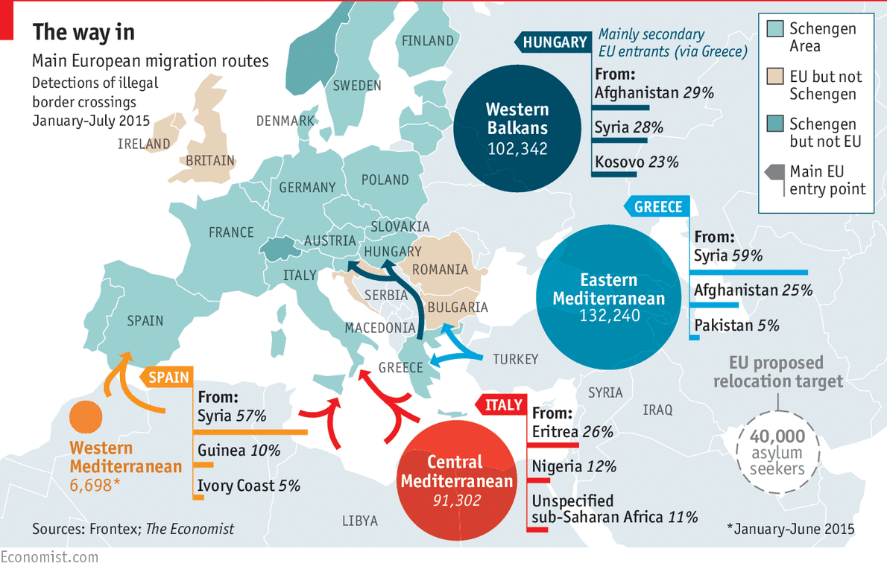
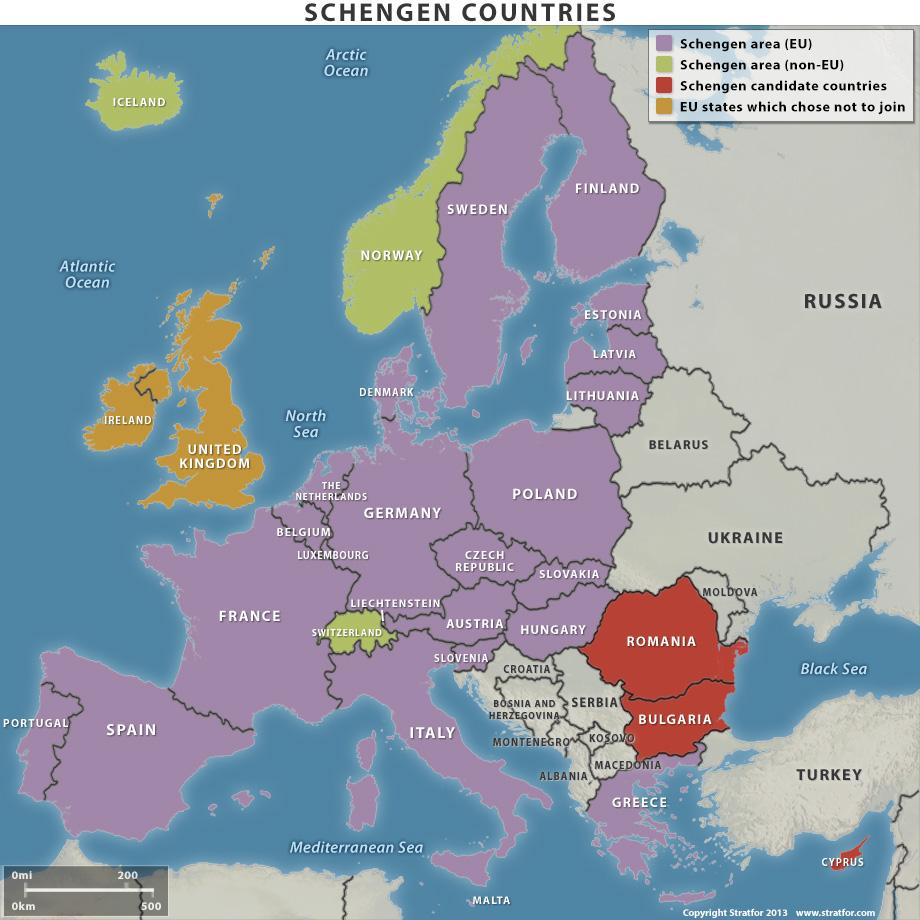

## Relevance and Explanation of the Issue
*“We can’t deter people fleeing for their lives. They will come. The choice we have is how well we manage their arrival, and how humanely.”*
This is the opinion voiced by Antónia Guterres, the current UNHCR. The United Nations (UN) has predicted that by the end of the current year there will 4.7 million registered  refugees. This is the worst exodus since the Rwandan genocide 20 years ago. It also does not include the 11 million who have already been killed or died fleeing their homeland, nor the 6.6 million Syrians internally displaced by the crisis. What is more is that Syria is only the tip of the iceberg. Add to the above figures 1.3 million internally displaced people (IDPs)  of Eritrea, the 44,000 Nigerian refugees and the continuous stream of  asylum applications from Kosovo, Albania, Serbia, and other non-EU European countries.

 

 
*Source: [An image by Frontex, found on The Economist;](http://www.economist.com/news/europe/21662597-asylum-seekers-economic-migrants-and-residents-all-stripes-fret-over-their-place-looking)*

The majority of refugees are taking a route through Turkey to enter Europe. To reach the shores, the refugees often end up in deals with human traffickers who take them across treacherous waters, in inadequate vessels, with little guarantee they will make it off alive. The few who do make it then often face long, painstaking trips on foot with little motivation other than to get as far away from that coastline as possible. It is also important to note that while all refugees are migrants, not all migrants are refugees.

The journeys are, again, only part of the problem. When these people arrive in Turkey, or Greece, or other Balkan regions, they seem to stir up quite a bit of social unrest. This is not entirely down to their actions, so much as it is the vast numbers of them. Their arrival seems to be a breeding ground for fear and segregation within an ever de-stabilising Europe. Germany has stated that all refugees are welcome and have adjusted their policies accordingly, while Hungary builds a fence around its border. Throw the Schengen Agreement  into the mix, and it seems unlikely we will come to a solution anytime soon. The Dublin III Regulation is probably the most prominent system of remedial measures in place regarding this crisis. The system establishes a hierarchy of criteria for identifying the Member States responsible for examination of an asylum claim in Europe. The aim of the Regulation is to ensure that one Member State is responsible for the examination of an asylum application, to deter multiple asylum claims and to determine as quickly as possible the responsible Member State to ensure effective access to an asylum procedure. There is more about the Dublin III Regulation later in the overview.

Essentially, one of the key conflicts facing Europe is where the line should be drawn between the EU’s self-interests and the upholding of its promise of being a leading example of inclusive and responsible democracy.

## Key Questions

* Are the current migrant systems within the EU effective?

* If not, what are the flaws in the system?

* How can the EU fairly distribute asylum applications, knowing that once the asylum seeker is accepted they can freely move between European countries, even if they do not necessarily fulfill each individual Member State’s criteria?

* What is currently being done to minimise social unrest and conflict in Member States?

* What can be improved on when it comes to looking after the health and welfare of the migrants?

* It does not look like the vast numbers of people arriving to Europe will slow down anytime soon - what long term measures can be put in place to ensure the welfare of migrants and the safety of european citizens?

## Key Facts & Figures

* 3,573 migrants died in the Mediterranean attempting to reach Europe in 2015. That is an average of ten people per day. As with most figures from the crisis, the numbers are already significantly increased for 2016.

* 0 (or very close to it) - The number of Syrian refugees who have been formally resettled in the wealthy states of the Persian Gulf, including Saudi Arabia, United Arab Emirates, Kuwait and Bahrain.

* Germany had by far the highest number of applications in 2015, with 441,800 people claiming asylum in the country, according to figures from the EU’s statistics agency.

## Key Actors

At the top of the scale we have the **EU** and the **European Commission**. The EU has the competence to lay down the conditions of entry and residence for third-country nationals entering and legally residing in one Member State for purposes of family reunification. **Member States** still retain the right to determine admission rates for people coming from third countries to seek work. The EU may provide incentives and support for measures taken by Member States to promote the  integration of legally resident third-country nationals; however, there is *no provision for harmonisation of national laws and regulations*. They are also required to prevent and reduce  irregular immigration  , in particular by means of an effective return policy, with due respect for fundamental rights. In the autumn of 2015, the European Commission adopted a "scheme for relocation and resettlement", known in the media as the “Asylum Quota”. Those *“in clear need of international protection”* within the EU will be relocated from Hungary, Greece and Italy. This is to be done according to a distribution key mainly based on the population and GDP of the Member States.

On a slightly smaller scale, but equally as important, we have the **UNHCR**, **FRONTEX**, the ** Organisation for Economic Co-operation and Development (OECD)** and the **International Organisation for Migration (IOM)**. The work of the UNHCR was mentioned earlier on. FRONTEX are an organisation who promote, coordinate, and develop European border management in line with the EU fundamental rights charter. IOM works to help ensure the orderly and humane management of migration. They aim to promote international cooperation on migration issues, to assist however possible in the search for practical solutions to the crisis and to provide humanitarian assistance to migrants in need- including refugees and IDPs. The OECD’s mission is to promote policies that will improve the economic and social well-being of citizens around the world. Their work has involved monitoring recent developments in migratory movements and policies within OECD countries, as well as analysing integration policies of immigrants and their children into both education and labour markets. The work of the OECD has thus far shown that migration, when effectively managed, has a positive role in the economy spurring innovation and growth.

One of the primary stakeholders in this issue however are the individual Member States themselves. Asylum applications are processed on a national level and those whose applications are granted must settle down in the country which accepted their application. On a supranational level, there is the **Dublin III Agreement** overseeing this application process, there will be more about this in the next section.

## Key Conflicts

The lack of a common EU immigration system has prompted Member States to adopt their own, short-term solutions, tailored to the demands and preferences of their own country, without recognising the impact this might have on neighbouring countries that share a common travel area. One of the biggest conflicts of this crisis stems from one of the few measures currently in place to fix it. As previously outlined, the migrant applications are being processed on a national level, that is to say, each Member State is responsible for processing the applications of the migrants whose initial landing spot in Europe is that particular country. The conflict arises with the **Schengen Agreement**. This agreement essentially abolished most of the EU’s internal borders, enabling passport-free movement across most of the block.

 

 

*Source: [stratfor](https://www.stratfor.com/image/map-schengen-countries)*

So, a migrant’s asylum application will be processed in the country they first land in, but because of Schengen they are entitled to free movement internally in Europe. However, while they may fill the applications criteria in one Member State, they may fall short of standards in another. It also has led to many migrants applying for asylum in countries with the easiest criteria to pass with, such as Germany or Sweden, and then moving to where they actually want to settle.

## Measures in place

In March of this year, **Turkey and the EU signed an agreement on the migrant crisis**. Under this agreement, migrants who illegally enter arrive at Europe’s borders via the Balkan route will be sent back to Turkey to await the results of their application procedure there. *In exchange for every illegal migrant sent back to Turkey by the EU, one refugee from the Turkish camps will be allowed to legally enter the EU,* and will be resettled under the aforementioned scheme. It is also likely that Turkey will receive up to €3 billion from the EU for the accommodation and hospitality of migrants headed for more central Europe.

Another measure in place is the current **Dublin III Regulation**. The system establishes a hierarchy of criteria for identifying which Member State should handle an application. Firstly, if an asylum seeker has family ties within an EU/EEA country, this country is responsible for handling the application. Secondly, when this is not the case, the Member State responsible for their entry into the territory of the EU/EEA is responsible for the application. This means that one must already be in the EU/EEA to apply for asylum, which has put tremendous pressures on the border countries of the EU, like Greece, Italy and Hungary. It is crucial to note that the Dublin agreement, up to and including its current iteration, aims to provide a coordinating system for the processing of applications. It is *not* involved in ensuring an equal distribution of migrants among Schengen states, and any attempts to circumnavigate the Dublin III Regulation are the consequence of a failure to establish a quota system within the EU.

## Links for Further Research

* A European Commission Press Release Document talking about the implementation of various schemes and systems to aid the crisis: [http://europa.eu/rapid/press-release_MEMO-15-5698_en.htm](http://europa.eu/rapid/press-release_MEMO-15-5698_en.htm)

* Some very interesting ideas put forward as solutions at the end of this document by the Overseas Development Institute (ODI): [http://www.odi.org/sites/odi.org.uk/files/odi-assets/publications-opinion-files/9913.pdf](http://www.odi.org/sites/odi.org.uk/files/odi-assets/publications-opinion-files/9913.pdf)

* A factsheet by the European Commission on the EU’s deal with Turkey: [http://europa.eu/rapid/press-release_MEMO-16-963_en.htm](http://europa.eu/rapid/press-release_MEMO-16-963_en.htm)

* A TED Talk with four solutions to the crisis put forwards: [https://www.ted.com/talks/alexander_betts_our_refugee_system_is_failing_here_s_how_we_can_fix_it?language=en](https://www.ted.com/talks/alexander_betts_our_refugee_system_is_failing_here_s_how_we_can_fix_it?language=en)

* OECD and UNHCR discussion on upscaling the integration policies to support refugees: [http://www.oecd.org/migration/oecd-and-unhcr-call-for-scaling-up-integration-policies-in-favour-of-refugees.htm](http://www.oecd.org/migration/oecd-and-unhcr-call-for-scaling-up-integration-policies-in-favour-of-refugees.htm)
