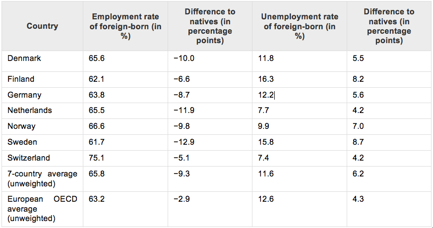

## Relevance and Explanation of the Issue

The Schengen Agreement is one of the Europe’s most remarkable achievements. Implemented in 1995, it allows free movement of people between its signatory countries – effectively removing border controls. It means that visas, rights of asylum and checks at borders outside the Schengen area apply across the whole Schengen area. The principle of Schengen is to bring countries closer together and increase international cooperation, trade and ultimately to aim for a peaceful resolution of disputes.

One of the key benefits to businesses in the catchment area is the ease with which goods and services can travel across country borders – thus making them more competitive compared to those arriving from non-Schengen area. It is a major contributing factor to the EU position as the world’s largest economic area.

The refugee crisis which has engulfed the continent for the past few months, leading to the closing of borders, has changed the “Schengen Treaty” by questioning the principle of freedom of movement. Increased migration poses policy problems across Europe, both in and out of Schengen and the EU, as any migrants need to quickly be assimilated into labour markets in order to reap the benefits of their relative youth.

The fact that countries which are not part of Schengen (such as the United Kingdom) are feeling the pressure of an increase in migration shows that curbs to the Schengen agreement are unlikely to have the desired political impact. The United Kingdom, as part of the negotiations conducted in the lead up to the “Brexit” referendum on 23rd of June, 2016, wanted to limit the access of EU workers to non-contributory in-work benefits, claiming that migrants only “abuse” their right of free movement.

Therefore Europe is faced with a two-fold problem: the desire to limit the freedom of movement within the EU (via increased border controls within Schengen or other barriers such as limiting benefits) whilst ensuring recent arrivals are able to find work as quickly as possible. Clearly increased scepticism towards migration and tougher visa and border schemes can make the process of migrating to Europe more cumbersome and therefore make it harder for migrants to ‘prove their worth’, yet it is ever more vital that they are given the opportunity to do so.

## Key Questions

* With the current economic instability amongst Member States, how can it be ensured that migrants will not be excluded from the labour market?

* As the number of refugees attempting to seek asylum in Europe continues to peak, what measures should be taken in order to ensure an inclusion of both migrants and refugees?

* How should the OECD and OSCE act upon the current situation of immigrants and simultaneously ensure stability and security amongst Member States?

* How can national governments guarantee speedy integration for all kinds of migrants into the labour market?

* Due to the continuing and imminent security threat on the external borders of Europe, how to ensure protection of human rights and non*discrimination of the immigrants inside the work environment?

## Key Facts & Figures

**The European Union**: The EU has developed an internal single market through a standardised system of laws that apply to all 28 Member States, as to give equal opportunities to all citizens in the labour market.

**The “Brexit Referendum”**: The EU referendum that will take place on 23rd of June 2016, concerning the British withdrawal from the European Union. The side that supports “Brexit” (British Eurosceptics), argue that it would allow the UK to be better able to control immigration, also yielding a better position to conduct its own trade negotiations, and to be free from what they believe to be unnecessary EU regulations and bureaucracy.

**The Refugee Crisis**: the European Refugee crisis began in 2015 when a rising number of refugees and migrants made the journey to the EU travelling across the Mediterranean Sea to seek asylum. The migrants and the refugees are coming mostly from Syria, Iraq and Afghanistan, countries that by the turbulence of war. They seek a better life in peace and inclusion in the labour market.

**The Organisation for Economic Cooperation and Development (OECD)** : a recent study, organised by the Organisation for Economic Cooperation and Development, took household-survey data to make detailed comparisons of immigrants and the native-born in terms of their net direct contribution to the public purse—the difference between what they pay in direct taxes and social-security contributions, and what they receive in benefits. Although immigrants generally pay their way, their net direct contribution does tend to be smaller than that of the native-born.
The OECD found that immigration generally has a favourable impact on national budgets, contributing 0.3% of GDP on average in 2007-09.

According to official OECD Data, Immigrants are underrepresented in employment and overrepresented to unemployment. The Table below shows the rates in seven OECD European countries (i.e. Denmark, Finland, Germany, the Netherlands, Norway, Sweden and Switzerland, during 2009 and 2010)

 

 
*Source: [http://izajom.springeropen.com/articles/10.1186/s40176-014-0023-6#CR13](http://izajom.springeropen.com/articles/10.1186/s40176-014-0023-6#CR13)*

## Key Actors

**The European Commission**: the EC is the executive body of the EU responsible for proposing legislation, implementing decisions, upholding the EU treaties and managing the day-to-day business of the EU.

**The Organisation for Economic Cooperation and Development (OECD)**: is an international economic organisation of 34 countries, founded in 1961 to stimulate economic progress and world trade. It is a forum of countries describing themselves as committed to democracy and the market economy, providing a platform to compare policy experiences, seeking answers to common problems, identify good practices and coordinate domestic and international policies of its members.

**The Organisation for Security and Cooperation (OSCE)**: the OSCE aims to ensure full respect of human rights and the freedom of movement for all citizens. It also covers the rights of foreigners to unrestricted movement within state borders and the facilitation of free cross border movement and contacts among people, institutions and organisations. 

## Key Conflicts

30 years after the creation of the Schengen Area, it is the right time to assess its achievements and values. Since the beginning, the Schengen Area tackled many challenges. Today, the Schengen Area is facing new types of crises such as the current wave of immigration due to the refugee crisis. The refugee crisis has affected migration as the Schengen Area countries decided to close the borders and block the movement of asylum seekers. The basic issue facing policymakers is accommodating new arrivals trying to find a job. Adding to the problem is the fact that some countries on the European continent are facing economic difficulties due to the economic crisis, making it even more difficult to offer job opportunities. As a result, unemployment rates are quite high in some Member States, and financial unemployment compensation is already strained without the prospect of further unemployment of the back of immigration. The proposed agreement with the UK  on the current immigration and labour policy could contradict  not only the principals of the EU labour law, but also the OSCE too, both supporting that all the immigrants should be included in the labour market and ensuring the protection of their human rights. The free movement right is for everyone inside the European borders both Member States citizens and non-Member State citizens. Once within the borders of the European Union and the Schengen area, third-country nationals also benefit from free mobility in practice, regardless of whether they have permission to legally reside or work in other countries because of the lack of internal border checks. The implications of this reality, together with the contemporary challenges facing Europe's external borders, have placed significant stress on free movement.

## Measures in place

The EU labour law goes hand in hand with the single market. The free flow of goods, services, capital and workers needs to be accompanied by labour law rules, to make sure that countries and businesses compete fairly on the strength of their products - not by lowering labour law standards. With over 240 million workers in the EU, EU labour law rights benefit large numbers of citizens directly and have a positive impact on one of the most important and tangible areas of their daily lives. The articles 45-48 of the Treaty on the Functioning of the EU, state that workers have the right to move freely and work anywhere in the EU, without discrimination on grounds of nationality, subject to exceptions to preserve public policy security and health.
The EU complements policy initiatives taken by individual EU countries by setting minimum standards i.e. working and employment conditions and informing and consulting workers. All employers, both native and immigrants are protected by the international human rights law, conducted by the United Nations (UN) and the international labour law conducted by the International Labour Organisation (ILO).

However, job opportunities are spread evenly across sectors or countries, worsening the situation even more. As a common EU labour policy has not been adopted yet, each Member State tries to tackle integration into the labour market differently. Different labour laws applies in each Member State due to complexity of each national constitution. However, a  common European labour law is currently being developed and under discussions in order to put on action EU’s competences
According to research on European OECD countries, the share of immigrants in the working age population is larger than the native population. It amounts around 13.3% on average across European OECD countries. Across all European OECD countries, differences in the employment and unemployment rates between immigrants and natives are smaller than in the seven countries investigated. In order to tackle with the high level of unemployment among immigrants and to foster their employment uptake, the national governments use some specific training programs called Active Labour Market Programs (ALMPs). These programs have two different categories: the first being specifically designed and targeted for immigrants and the second one, targeting the native population of each country. These programs are being applied in Germany, Sweden and Finland and they have three categories for migrants interest: i) language training of the host country, ii) introduction programs for employment integration, iii) general programs for immigrants interests.

## Links for Further Research

* [An article upon the effects upon the European Businesses due to the closing of borders](http://businessculture.org/blog/2015/09/04/european-business-will-suffer-if-border-crossings-between-european-neighbours-are-shut/)

* [General explanation of the EU labour law](http://ec.europa.eu/social/main.jsp?catId=157)

* [An article about the the “added-value” of the Schengen Area](http://blog.unitee.eu/diverbusiness/is-schengen-area-an-added-value-for-eu-countries )

* [The official European Union (EU) Review about the current status of the economy](http://europa.eu/about-eu/facts-figures/economy/index_en.htm)

* [A review by the Government Gazette about the European Borders Security and Immigration](http://governmentgazette.eu/wp-content/uploads/2013/GGMar_Border%20Security_pp35-55.pdf)

* [Article on the Telegraph about David Cameron’s four EU reform demands](http://www.telegraph.co.uk/news/newstopics/eureferendum/11984815/What-are-David-Camerons-four-EU-reform-demands-and-do-they-matter.html)

* [Analysis on the Bruegel blog about how the European economies will affected by the refugees](http://bruegel.org/2015/10/how-will-refugees-affect-european-economies/)

* [Article on the Economist concerning to the question of immigration being whether a Boon or a Burden](http://www.economist.com/news/finance-and-economics/21579482-new-study-shows-fiscal-impact-migration-broadly-neutral-boon-or)

* [Article on the Telegraph concerning to UK’s tougher immigration restrictions](http://www.telegraph.co.uk/news/politics/11150390/David-Cameron-secures-tougher-immigration-restrictions-on-new-EU-numbers.html)

* [Article on the Telegraph concerning to the true scale of immigration in the European Union](http://www.telegraph.co.uk/news/2016/04/03/true-scale-of-eu-immigration-to-be-revealed-just-weeks-before-re/)

* [Article on the Telegraph questioning whether the United Kingdom should leave the EU in order to have freedom to let immigrants in](http://www.telegraph.co.uk/education/2016/03/29/uk-should-leave-the-eu-to-have-freedom-to-let-migrants-in/)
