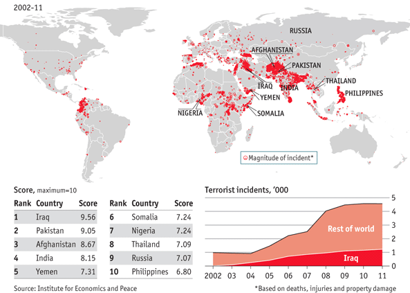

## Relevance and Explanation of the Issue

7th of January 2015, 11 killed, 11 injured; 13th of November 2015 130 killed, 368 injured; 22nd of March 35 killed, over 300 injured.

These are only 3 examples of terror attacks in the past two years and according to the BBC at least the  last two attacks are linked. At the moment there is some speculation as to whether the Brussels attacks could have been averted by sharing knowledge, as it was already known who the perpetrators behind the Paris attacks were and some of them are key suspects in the Brussels attacks as well.

Now there is a call for more intelligence sharing.  ENTER TEXT HERE  However the history of intelligence sharing in the EU is a short one. The topic first came up in 2000 with the European Security and Defence policy (ESDP), which was given impetus by the 1999 Helsinki meeting of the European Council. Since 2012 the EU Situation Center (SITCEN), that was created with the ESDP, is called EU Intelligence Analysis Center (INTCEN)  ENTER TEXT HERE  and a part of the EEAS. It provides the High Representative with information that is not available overtly, based on contributions from member states intelligence and security services. They support and assist the President of the European Council and the President of the European Commission in the exercise of their respective functions in the area of external relations and provide assessments and briefings.

Another institution that added Intelligence sharing to their agenda is the NATO. At the 2002 Prague Summit intelligence sharing was defined as one key aspect of cooperation between states. Therefore a Terrorist Threat Intelligence Unit was set up. Since then intelligence sharing has changed and improved.   ENTER TEXT HERE 

Especially in the EU there are big concerns at the moment because of the refugees crisis and the high number of asylum seekers entering the EU. In 2015 more than one million people crossed into Europe and the number  is expected to rise. Terrorists are using this crisis to plan further terror attacks not just in Europe but  also in the USA.  However it is not possible to do a detailed background check on everyone crossing the border. Background checks are being done but only in the process of asylum.

Last November Guy Verhofstadt, the leader of the Liberals in the European Parliament, stated, "cooperation between the EU’s intelligence services is a failure. After each tragedy, we realise that our cooperation does not work." The problems are that each state has its own security service and National Intelligence Agencies. In the EU there is a gap between the West and the East as Bernhard Squarcini, France’s spy chief under former president Nicolas Sarkozy pointed out: “With eastern European countries as EU members, no one wants to share details on sensitive operations. It’s a question of trust.”

However not just the intelligence sharing within the EU failed, but also the communication with non-Member States. Turkey warned Brussels about the Al Bakraoui brothers with jihadist connections trying to get to Belgium. However Brussels answer on this warning got lost on the way to Turkey. Other states had Al Bakraoui on the Terrorist watch list. In addition to the struggles with interstate communication sometimes even the intrastate communication of the security services fail. One well known examples for this case are the terror attacks on 11th of September 2011. The CIA had two of the terrorists already on the watchlist but this was never communicated to the FBI.

## Key Questions

* Is there the need of a common intelligence agency?

* How could a common intelligence agency look like?

* Should more intelligence be shared?

* How much is realistic to share?

* Would sharing more intelligence endanger our privacy?

* Is terrorism predictable?

* What technical or other communication mechanisms could improve information and intelligence sharing?

* Have information classification and sensitivity issues significantly hindered the transmission of information and intelligence?

## Key Facts & Figures

* Terrorism has caused  over 130.000 fatalities in approximately 90.000 terrorists attacks worldwide between 2006 and 2013

 

 
*Data and world map on global terrorism, 2002-2011 – The Economist*

*  So-called lone wolves — individuals or small groups working without the aid of a larger organization — are responsible for  70 percent of terrorism deaths in the West, and that number is rising. 

* On average, there were  1,122 terrorist attacks, 2,727 deaths, and 2,899 injuries per month worldwide in 2014. There were 2.57 fatalities and 2.87 injuries per attack, including perpetrator casualties. 

## Key Actors

The  ENTER TEXT HERE  handles criminal intelligence and the combating of serious international organised crime. This involves cooperating with the relevant authorities of the member states, including those tasked with customs, immigration services, border and financial police etc.

Therefore they work together with the **National security agencies** and the **National intelligence agencies** of the member states. Their task is to collect intelligence and share it with the government for the internal security of the state.

Although the states have the information needed, they often do not share it due to a lack of trust in other states and the concern about how the data is going to be used. The **OSCE** tries to change that by building up CBMs between the affected parties. Furthermore it contributes with its expertise in conflict prevention, crisis management and early warning to world-wide efforts in combating terrorism. **ODIHR (Office for Democratic Institutions and Human rights)**  ENTER TEXT HERE  is an OSCE institution that works to build the capacity of public officials and law enforcement in respecting and promoting human rights as a means to effectively preventing and combating terrorism. The Office provides expert analysis and supports participating States, upon request, in drafting anti-terrorism laws and strengthening existing legislation in line with international human rights standards. The **UN Counter Terrorism Committee (CTC)**  ENTER TEXT HERE  is not a direct capacity provider but it does act as a broker between those states or groups that have the relevant capacities and those in the need of assistance. Their working methods are country visits, technical assistance, country reports, best practices and special meetings.

## Key Conflicts

The first key conflict is the **lack of trust between** the affected states and institutions. By not sharing the information they have, communication lapses. The cooperation between the National Intelligence Agencies is badly affected by mistrust.

Although some of them are willing to share intelligence and best practices, others prefer to keep the data on a national level and to only protect the nationals interest.

The next challenge we face is to find **a compromise between security and privacy.** By sending data about people crossing the border or other private activities to other countries, the citizens privacy would have to be compromised. Finding the balance is almost impossible as the wishes and needs of every citizen are different. It is important to find a secure way to share the information. ICTs are one possibility, however they are not safe enough yet. Additionally there are differences in the **legislative functioning** of the states that are hard to bring together on one level in order to build a shared Intelligence agency.

## Measures in place

In the **Charter of Paris for a new Europe**  ENTER TEXT HERE  the Heads of the states participating in the OSCE made the following agreement: *"We unreservedly condemn, as criminal, all acts, methods and practices of terrorism and express our determination to work for its eradication both bilaterally and through multilateral co-operation.*" (Paris, 19 - 21 November 1990)

**OSCE Charter on Preventing & Combating Terrorism **of the 7 December 2002 shows the strong position of the OSCE on terrorism.

**UN's Global Counter Terrorism Strategy**  ENTER TEXT HERE  consistently, unequivocally and strongly condemns terrorism in all its forms and manifestations, committed by whomever, wherever and for whatever purposes, as it constitutes one of the most serious threats to international peace and security.Furthermore it calls for a better cooperation and information sharing.

**The Prüm Decision** from 2005 is open to all members of the EU and enables signatories to exchange data regarding DNA, fingerprints and Vehicle registration of concerned persons and cooperates against terrorism. The data exchange provisions are to be implemented in 2012.

## Links for Further Research

*Intelligence Sharing in Europe: *

* "EU doesn’t need a CIA – but better intelligence would help" - An interview with the Swedish researcher Björn Fägersten who works at the Institute of International Affairs about Intelligence Sharing in Europe.
[http://www.euractiv.com/section/global-europe/opinion/eu-doesn-t-need-a-cia-but-better-intelligence-would-help/](http://www.euractiv.com/section/global-europe/opinion/eu-doesn-t-need-a-cia-but-better-intelligence-would-help/)

* "For EU eyes only? Intelligence and European security" - An article by Björn Fägersten about how to increase intelligence in a realistic way.
[http://www.iss.europa.eu/uploads/media/Brief_8_EU_Intelligence_Cooperation.pdf](http://www.iss.europa.eu/uploads/media/Brief_8_EU_Intelligence_Cooperation.pdf)

* "Simplifying the exchange of information between law enforcement authorities" - this framework should simplify the exchange of information between law enforcement authorities in the member states.
[http://eur-lex.europa.eu/legal-content/EN/TXT/?uri=URISERV%3Al14581](http://eur-lex.europa.eu/legal-content/EN/TXT/?uri=URISERV%3Al14581)

*OSCE*

* "Who we are" - The function, history and fields of the OSCE:
[http://www.osce.org/whatistheosce](http://www.osce.org/whatistheosce)

* "Combating Terrorism" - OSCE
[http://www.osce.org/what/terrorism](http://www.osce.org/what/terrorism)

* "OSCE Charter on preventing and Combating Terrorism"
[http://www.osce.org/odihr/16609?download=true](http://www.osce.org/odihr/16609?download=true)

* "Decision No. 1063 OSCE Consolidated Framework for the fight against Terrorism"
[http://www.osce.org/pc/98008?download=true](http://www.osce.org/pc/98008?download=true)
