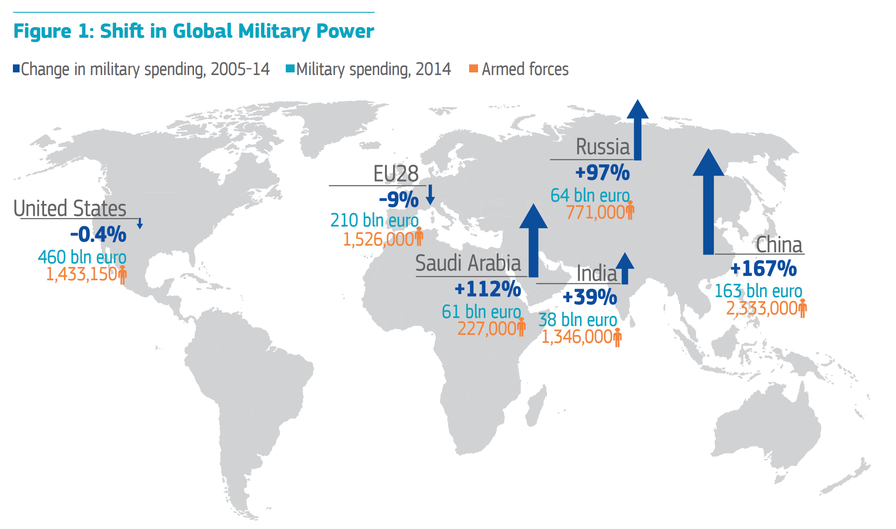

## Relevance and Explanation of the Issue

In the wake of the great recession of 2008 and the subsequent European sovereign debt crisis, many Member States made sizeable **cuts to defence spending** as part of austerity measures. Between 2006 and 2013 Member States  cut their defence spending as a share of GDP by almost 20 %. This development however stands in strong contrast with recent developments regarding the EU’s Eastern neighbours: Russian **aggressions** in Ukraine and Georgia, now-regular {% tooltip  European Leadership Network (2015). List of Close Military Encounters Between Russia and the West, March 2014 – March 2015. Retrieved from: <a href='http://www.europeanleadershipnetwork.org/medialibrary/2015/03/11/4264a5a6/ELN%20Russia%20-%20West%20Full%20List%20of%20Incidents.pdf'>http://www.europeanleadershipnetwork.org/medialibrary/2015/03/11/4264a5a6/ELN%20Russia%20-%20West%20Full%20List%20of%20Incidents.pdf</a> %} **provocations near the borders of** Member States, as well as its involvement in the ongoing **civil war in Syria** has caused some Member States to reconsider their previous defence spending cuts. Besides Member States, the  United States has also expressed concerns regarding the level of European defence spending.

In order to improve the cost efficiency of Member States’ armed forces, and to strengthen the EU’s international influence  through **the acquisition of military power**, some have proposed increased European military cooperation and integration as a solution. Largely, such defence integration can be split up into two distinct categories:  **international military policy integration**  and  **military capability integration**. Roughly, these categories correspond to integration in terms of international and national policy. The EU today possesses some military capabilities under the **Common Security and Defence Policy** (CSDP) in the form of  **EU Battlegroups**, although their status as true EU resources is debatable as they are national military units temporarily held ready for EU usage. The **European Defence Agency**, a body of the CSDP, supports Member States’ cooperation regarding defence equipment procurement. Some international military operations is also coordinated {% tooltip  European Union Force (EUFOR) is a generic name for a EU rapid deployment force, operated as part of the CSDP. The main purpose It has been temporarily deployed four times: in Macedonia (2003), Bosnia and Herzegovina (2004), the Dem	ocratic Republic of the Congo (2006), and in Chad and the Central African Republic (2007 and onwards). In addition European Union Naval Force (EU NAVFOR) has been deployed two times: in the Mediterranean sea (2015 and onwards) and in Somalia (2008 and onwards). (European External Action Service (2016). Ongoing missions and operations. Retrieved from: <a href='http://www.eeas.europa.eu/csdp/missions-and-operations/index_en.htm)'>http://www.eeas.europa.eu/csdp/missions-and-operations/index_en.htm)</a> %}  through EU battlegroups and European Union Forces  (EUFORs). A shift towards further granting the EU its own military capabilities is not a simple matter of efficitivisation and rationalisation, but rather a question of whether - and if so to what extent - military power is compatible with the EU’s founding principle of peace through cooperation and integration.

Although the EU historically has been an organisation mainly working internally with its Member States’ trade and other matters,  all but six of the EU’s current Member States are members of the North Atlantic Treaty Organisation (NATO), an organisation that historically has served to strive for peace by strengthening military cooperation regarding its members’ territorial defence. The Berlin Plus agreement lays out the cooperation between NATO and the EU, but  has been criticised  for not sufficiently furthering strategic dialogue and cooperation as well as lacking real-world influence. This raises the question of whether the EU primarily should create its own frameworks for military integration and cooperation, or if its focus should be put on improving cooperation within the already existing NATO structure.

## Key Questions

* Is acquiring military capabilities - directly or indirectly - ideologically compatible with the EU’s founding principle of peace through European integration?

* Would further military integration within the EU be at all desirable, or is military power best handled directly by Member States?

* If found to be desirable, under which conditions and by which means should military integration take place?

* Should the EU primarily focus be on creating its own structures for military cooperation, or strengthening cooperation with NATO?

* How could decision making regarding common military capabilities be handled efficiently within the EU’s legal framework?

## Key Facts & Figures

Overview of military spending in the EU and the world’s six biggest spenders between 2005 and 2015:
 

 

*Source: [European Political Strategy Centre (2015). In defence of Europe: Defence Integration as a Response to Europe’s Strategic Moment.](http://ec.europa.eu/epsc/pdf/publications/strategic_note_issue_4.pdfhttp://ec.europa.eu/epsc/pdf/publications/strategic_note_issue_4.pdf)*

* Between 2005 and 2015 only two Member States increased military spending as share of GDP: Estonia (+7 %) and Poland (+14 %).  In comparison, Russia increased its military spending as share of GDP by 51 % during the same period. 

* 15 % of defence equipment procurement costs in Member States were related to European collaborations in 2013.  The same share for defence research and technology costs was 8 %.

* Six EU Member States not members of NATO: Austria, Cyprus, Finland, Sweden, Ireland and Malta. Similarly, six NATO members are not members of the EU: The United States, Canada, Norway, Turkey, Iceland, and Albania.

For more statistics and diagrams, see this document: [http://www.eda.europa.eu/docs/default-source/eda-publications/eda-defence-data-2013_web](http://www.eda.europa.eu/docs/default-source/eda-publications/eda-defence-data-2013_web)*

## Key Actors

The **European External Action Service** (EEAS) serves as the diplomatic corps of the EU, responsible for carrying out the EU’s foreign policy as agreed upon unanimously by Member States. The overall aim of the EEAS is to make European foreign policy more synchronised and thereby more effective. Notably, foreign policy decisions within the EU is only handled by the **Council of the EU** and not by the European Parliament as is common for many other policy fields. In terms of **competence**, the EU has the competence to conduct a common foreign and security policy. Said policy is however required to be agreed upon unanimously in the Council of the EU, meaning that the EU cannot influence the foreign policy of a Member State against its will. Defence policy is not at all a competence of the EU, meaning that Member States are free to decide upon policy themselves.

The EU’s **Member States** are at the very center of the EU, and between Member States foreign policy interests and priorities may sometimes align but sometimes diverge.  Some Member States are enthusiastic about EU military cooperation, whilst others are less so - for example Denmark has a  **permanent opt-out** from the CSDP. Additionally some Member States, such as the Netherlands and Germany, cooperate bilaterally and have for example  integrated military units. Member States enjoy full command over their own military forces; whatever power the EU might have over for example its Battlegroups is only derived from Member States’ voluntary commitments.

The **North Atlantic Treaty Organisation** (NATO), unifying 22 Member States and six non-Member States in a military alliance dated 1949, serves to guarantee its members security and freedom through political and military cooperation. Due to the large overlap in membership between NATO and the EU there can also be said to be a sizeable overlap of interests: both NATO and the EU strive to maintain security in Europe. However, as some NATO members are not EU Member States, such countries -  for example the US - also take interest  in the the EU’s defence policy. In 1998 former US secretary of state Madeleine Albright famously framed what the US wanted the EU to keep away from the CDSP in the three D’s: no duplication of NATO effort and resources, no decoupling of the US from NATO, and no discrimination against non-EU members (such as Turkey).

The **Organisation for Security and Co-operation in Europe**(OSCE) is  an international organisation gathering 57 Member countries  that are both European and non-European, with the overall aim of furthering European security in terms of political, military, environmental as well as human security. Much of its work with military security is conducted through the  **Forum for Security Cooperation** , providing a platform for amongst other things information exchange  on military policy and budgets, observation of military operations, overseeing the democratic control of military forces, and international discussion on security issues.

## Key Conflicts

A core conflict within this topic is between the EU having military capabilities, and the Union’s founding principle of peace through European integration and cooperation. Although  the EU’s first predecessor was established in 1951, it was not until the 1990’s that the EU even aspired to gain foreign policy influence. Thus, the the question is whether an organisation so fundamentally rooted with the concepts of peace and cooperation at all should use military power internationally, or if it should constrain itself to  ‘soft power’  and economic sanctions in the foreign policy arena.

Another consideration is between EU influence and Member State influence. Does the burden of defence policy naturally fall upon Member States, or would the EU better handle defence policy and military forces? National sovereignty and the political sensitivity of  defence policy speak for Member States maintaining their power, while shifting power to the EU could  increase cost-efficiency and foreign policy effectivity?

## Measures in place

The  **Common Security and Defence Policy**  (CSDP) is an arm of EU’s Common Foreign and Security Policy (CFSP). Although foreign policy decisions normally need to be adopted unanimously by the Council of the EU, the CFSP is considered so sensitive that it is formally in the domain of the **European Council**, which gather all Member States’ heads of state or government. It is under the CSDP that many current initiatives are organised, for example  EU Battlegroups . Not primarily dealing with military power, the CSDP is aimed at peacekeeping, conflict prevention and international security. The  **European Defence Agency**(EDA) , a body of the CSDP, support the building of Member States’ military capabilities. It does this by coordinating and  assisting Member States with defence equipment procurement, and has recently launched a  **Pooling & Sharing**  initiative to support Member States in sharing resources. The CSDP does not in its current form deal with European territorial defence, which is rather considered a NATO domain, although article 42(2) of the Treaty on the European Union (TEU) states that "[the CSDP] will lead to a common defence, when the European Council, acting unanimously, so decides."

**Permanent Structured Cooperation** (PESCO) is an already-existing legal framework for permanent military integration within the EU amongst those Member States that are willing to participate,   which some argue   is the way forward  for European defence policy. Although it in practice has not been operationalised, it is could be  one of the most easily available routes  to proceed with European military integration. As already established in the  Treaty on the Functioning of the European Union (TFEU), PESCO would establish cooperation in five fields: budgetary coordination, equipment pooling and sharing, interoperability and readiness, military capabilities, and equipment procurement.

**Bilateral defence cooperation** exists between some Member States that have agreed to integrate units from their armed forces. For example Germany and France  have a joint mechanised brigade since 1988, and the Netherlands this year has  **permanently integrated a mechanised brigade** in a German tank division. Some argue that bilateral cooperation is the most realistic form of defence integration, although the increasing usage also could make a  Europeanisation of defence policy more difficult.

**Article 222 of the Treaty on the Functioning of the European Union and article 42(7) of the Treaty on the European Union** are known as the solidarity clause and the mutual defence clause. Through them Member States are obliged to provide support and assistance if a Member State is subjected to "a terrorist attack or a natural or man-made disaster", and to provide “aid and assistance by all the means in their power” if another Member State is subjected to armed aggression. Although the mutual defence clause has been invoked once -  by France after last year’s terrorist attacks in Paris - the practical implications of both clauses in a broader defence context remain unclear.

 The **Vienna Document**  is an agreement between the members of the OSCE that aims to increase openness and transparency about military activities. It does this by obligating its signatories to exchange information on - amongst other things - military capabilities, operations, defence planning, as well as inspections and observations of military installations, equipment and activities.

The   **Berlin Plus agreement** defines  the relationship and the division of certain areas of responsibility between the EU and NATO. The overlaps in membership between NATO and the EU, which has the CSDP, caused concerns about the duplication of assets and structures, which resulted in the Berlin Plus agreement to divide responsibilities for crisis management. Amongst other things, the agreement provides a structure for the EU to utilise NATO resources and assets for EU-led crisis management operations and guarantees the EU access to NATO planning capabilities.

The  **Petersberg tasks** are military priorities included in the CSDP that the EU is empowered to perform in terms of crisis management: humanitarian and rescue tasks, conflict prevention and peacekeeping, military advice and assistance, tasks of combat forces in crisis management such as peacemaking, disarmament operations, and post-conflict stabilisation. A key part of securing readiness to perform the petersberg tasks is the EU’s Battlegroups, at least two of which are continuously kept ready to be deployed within 10 days after a decision.

## Links for Further Research

* Centre for European Policy Studies (2015). More Union in European Defence. Retrieved from: [https://www.ceps.eu/system/files/TFonEuropeanDefence.pdf](https://www.ceps.eu/system/files/TFonEuropeanDefence.pdf)

* European Political Strategy Centre (2015). In defence of Europe: Defence Integration as a Response to Europe’s Strategic Moment. Retrieved from: [http://ec.europa.eu/epsc/pdf/publications/strategic_note_issue_4.pdf](http://ec.europa.eu/epsc/pdf/publications/strategic_note_issue_4.pdf)

* European Parliamentary Research Service (2015). European defence cooperation. Retrieved from: [http://www.europarl.europa.eu/RegData/etudes/BRIE/2015/551346/EPRS_BRI(2015)551346_EN.pdf](http://www.europarl.europa.eu/RegData/etudes/BRIE/2015/551346/EPRS_BRI(2015)551346_EN.pdf)

* Madariaga - College of Europe Foundation (2010). Is Permanent Structured Cooperation a Workable Way Towards EU Defence? Retrieved from: [http://www.madariaga.org/images/madariagareports/2010-dec-6-ispescoaworkablewaytowardseudefence.pdf](http://www.madariaga.org/images/madariagareports/2010-dec-6-ispescoaworkablewaytowardseudefence.pdf)

* German Institute for International and Security Affairs (2013). How to maintain hard capabilities in times of budget cuts. Retrieved from: [http://www.institutdelors.eu/media/tgae20117eondarza.pdf?pdf=ok](http://www.institutdelors.eu/media/tgae20117eondarza.pdf?pdf=ok)
